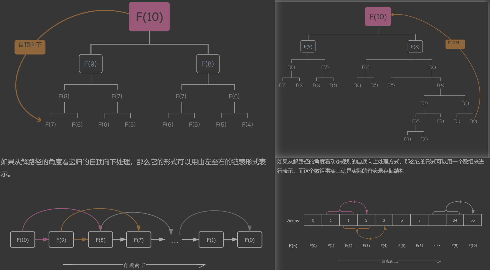

DP(Dynamic Programming) 

[贪心算法](../greedy/readme.md)主要的思路是局部最优，而如果要求全局最优的话，大部分情况下贪心算法就无能为力了，但贪心算法是所有讨论最优解问题的核心接基础！

最优解的问题，就是指在某些约束条件下，决定可选变量应如何取值，使其变量代入目标函数后最优。

从数学意义上说，最优解问题可以看作是一种求极值的方法，即在一组约束为等式或不等式的条件下，使目标函数达到极值。

在[贪心算法](../greedy/readme.md) 中的示例中可以将问题抽象为这样的最优解问题：硬币面额种类 coins 有 (5, 3) 两种，约束条件为 5x + 3y = k，当满足这个约束条件时，求解函数中的 x、y 使得 f = x + y 的值最小。

这种离散型的最优化问题就是去所有满足条件的组合中找出最优解的最合。那么该如何找到最优解呢？[通过枚举+递归的策略](../greedy/getMinCoinCount_test.go)，递归求得所有的组合，然后枚举这些组合来做判断。

递归其实借助了堆栈来暂存当前或之前的数据，即通过堆栈实现了状态存储。

递归只是让问题可以求解，但如果数据规模过大的时候，暴力递归会引发极大的性能问题。所以通常会对递归进行剪枝优化。如：避免相同条件下的重复搜索过程，即重叠子问题；有些问题可以参考贪心算法，从整体的搜索策略上调整，面额大的硬币足够多，自然最后的硬币组合的数量也就最少，所以找到第一个满足条件的其实也就得到了最优解；。

通常会采用备忘录解决递归中遇到的重叠子问题，对于被网络，可以考虑这两种数据结构：数组、哈希表。

动态规划的问题具有几个特征：

- 重叠子问题，在穷举过程中存在重复计算的现象
- 无后效性，子问题间的依赖是单向性的，某阶段状态一旦确定，就不受后续决策的影响
- 最优子结构，子问题间必须相互独立，或者说，后续的计算可以通过前面的状态推导出来

> 最优子结构：
> 假设在外卖平台购买 5 斤苹果、3 斤香蕉，要求以最低价格购买这些水果
> 由于促销的缘故，两中水果都有一个相互独立的促销价。这种情况下，由于促销价格互不影响，所以只需购买就能享受到最低折扣的价格，符合最优子结构；
> 如果平台增加一个条件：折扣不能同时享用。此时，由于子问题并不独立，两种水果的价格无法同时达到最优，这时最优子结构被破坏。

- 自顶向下：通过备忘录进行剪枝的递归中，思路是从目标问题开始，不断将大问题拆解为子问题，然后继续拆解子问题，直到子问题不可拆解为止，然后通过备忘录就可以直到哪些子问题已被计算过，从而提升效率。
  - 每次使用备忘录的数据时需要先检查该子问题是否已经求解了
- 自底向上：首先求出所有的子问题，然后通过底层的子问题向上求解更大的问题。这样，当求解大问题时，就可以确保其依赖的所有子问题已经计算过了，直接从备忘录中取出来即可。

以斐波那契数列为例：



特殊：在 leetcode-152 题！

# 题目特点

- 计数
    - 如：多少种方式走到右下角；多少种方法选出 k 个数使得和为 sum
- 求最大最小值
    - 如：左上角走到右下角路径的最大数字和；最长上升子序列长度
- 求存在性
    - 如：取石子游戏，先手是否必胜；能不能选出 k 个数使得和为 sum

思路：穷举！是否存在重叠子问题、最优子结构等特性？

解题步骤：

1. 确定dp数组（dp table）以及下标的含义
2. 确定递推公式
3. dp数组如何初始化（有些情况是递推公式决定了dp数组要如何初始化，所以初始化放在递推公式后面）
4. 确定遍历顺序
5. 举例推导dp数组

- 题目：
    - 斐波那契数列：509
    - 交换硬币：518、322
    - 爬楼梯：70、746
    - 找路径：62、73
    - 二叉搜索树：96

# 背包问题

[背包问题总结篇](https://github.com/youngyangyang04/leetcode-master/blob/master/problems/%E8%83%8C%E5%8C%85%E6%80%BB%E7%BB%93%E7%AF%87.md)

## 01 背包

- 题目：
    - 正常：416、1049、494
    - 变体：474（物品的重量有两个维度）


[01背包](https://mp.weixin.qq.com/s?__biz=MzUxNjY5NTYxNA==&mid=2247486598&idx=1&sn=dd7d0530dd7a5caef7ce70cc3d6eee3f&scene=21#wechat_redirect)

数组：weight 代表物品重量，value 代表物品价值

1. dp 数组（二维）：`dp[i][j]` 代表了从下标为 [0-i] 的物品中任取，将其放入容量为 j 的背包后的**最大价值**
2. 递推公式：`dp[i][j]` 是最大价值，
    1. 如果容量为 j 的背包装不下下标为 i 的物品，则 `dp[i][j] = dp[i-1][j]`
    2. 如果容量为 j 的背包装得下下标为 i 的物品，则最大价值可以从以下两个值中比较得到（假设容量为 5，物品重量为 3）
        1. `dp[i-1][j]` 容量为 j 的背包不装下标为 i 的物品时的最大价值（先装了重量为 4 的多个物品，剩余容量不够再装）
        2. `dp[i-1][j-weight[i]] + value[i]` 容量为 j 的背包将下标为 i 的物品装进去时的最大价值（刚好装下重量为 3 的物品，其价值为 `value[i]`，也即已经装了重量为 2 的物品，其价值为 `dp[i-1][j-weight[i]]`）
3. dp 数组初始化：
    1. 容量为 0 时，无论物品怎么选，背包价值一定为 0，所以 `dp[i][0] = 0`
    2. 由推导公式可以看出，i 是由 i-1 推导出的，所以 `i == 0` 时一定要初始化：如果背包装不下物品(`j < weight[0]`)，则 `dp[0][j] = 0`；如果背包装得下物品(`j >= weight[0]`)，则 `dp[0][j] = value[0]`
    3. 其他位置初始化为 0 即可，在遍历过程中会被覆盖
4. 遍历顺序（以下两种都可以，但存在区别）
    1. 先遍历物品再遍历背包
    2. 先遍历背包再遍历物品

```go
package main

// 已知条件
func zeroOneBag(weight, value []int, bagWeight int) int {
	weightLength := len(weight)
	// dp 数组
	dp := make([][]int, weightLength+1)
	for i := range dp {
		dp[i] = make([]int, bagWeight+1)
	}
	// 初始化
	for j := weight[0]; j <= bagWeight; j++ {
		dp[0][j] = value[0]
	}
	// 先遍历物品再遍历背包
	for i := 1; i < weightLength; i++ {
		for j := 0; j <= bagWeight; j++ {
			if j < weight[i] {
				dp[i][j] = dp[i-1][j]
			} else {
				dp[i][j] = max(dp[i-1][j], dp[i-1][j-weight[i]]+value[i])
			}
		}
	}
	return dp[weightLength-1][bagWeight]
}
```

如果先遍历背包再遍历物品：

```go
	// 先遍历背包再遍历物品
	for j := 0; j <= bagWeight; j++ {
		for i := 1; i < weightLength; i++ {
			if j < weight[i] {
				dp[i][j] = dp[i-1][j]
			} else {
				dp[i][j] = max(dp[i-1][j], dp[i-1][j-weight[i]]+value[i])
			}
		}
	}
```

---

[01背包-滚动数组](https://mp.weixin.qq.com/s?__biz=MzUxNjY5NTYxNA==&mid=2247486624&idx=2&sn=96e8c6344dc25f57462b675b55ccd6e7&scene=21#wechat_redirect)

1. dp 数组（一维），`dp[j]` 代表了容量为 j 的背包，所装的物品最大价值为 `dp[j]`
2. 递推公式：`dp[j] = max(dp[j], dp[j - weight[i]] + value[i])`
3. 初始化：`dp[0] = 0`，由于递推公式中取得是最大价值的数，所以下标非 0 的都初始化为0，如果存在价值为负数的物品，那么非 0 下标的值需要初始化为负无穷
4. 遍历顺序：只能先遍历物品再遍历背包！

```go
// 必须是先遍历物品再遍历背包！
func zeroOneBag(weight, value []int, bagWeight int) int {
	dp := make([]int, bagWeight+1)
	for i, w := range weight {
		for j := bagWeight; j >= w; j-- {
			dp[j] = max(dp[j], dp[j - weight[i]] + value[i])
		}
	}
	return dp[bagWeight]
}
```

- 为什么背包倒序遍历？

注意，**背包的遍历是倒序的！是为了保证物品 i 只会被放入一次！！**

说明：假设下标为 0 的物品，`weight = [1, 3, 4], value = [15, 20, 30]`

```go
// 正序遍历
dp[1] = dp[1 - weight[0]] + value[0] = 15
dp[2] = dp[2 - weight[0]] + value[0] = 30   // 这里下标 0 的物品价值被计算了两次！
// 倒序遍历
dp[2] = dp[2 - weight[0]] + value[0] = 15
dp[1] = dp[1 - weight[0]] + value[0] = 15
```

而之前二维数组中，由于 `dp[i][j]` 都是通过上一层，即 `dp[i-1][j]` 计算出来的，本层的 `dp[i][j]` 并不会被覆盖！

- 为什么不能先遍历背包再遍历物品？

因为一维数组时，背包必须倒序遍历。如果先遍历背包的话，那么每个 `dp[j]` 中就只会放入一个物品！

## 完全背包

- 题目：
    - 排列数：518、377、[有多少种不同的爬楼梯方法？](https://github.com/youngyangyang04/leetcode-master/blob/master/problems/0070.%E7%88%AC%E6%A5%BC%E6%A2%AF%E5%AE%8C%E5%85%A8%E8%83%8C%E5%8C%85%E7%89%88%E6%9C%AC.md)、322
    - 组合数：279
    - 特殊：139

[完全背包](https://mp.weixin.qq.com/s/akwyxlJ4TLvKcw26KB9uJw)

完全背包和01背包问题唯一不同的地方就是，每种物品有无限件，即可以被添加多次，所以在遍历背包的时候需要从小到大的遍历：

```go
// 先遍历物品后遍历背包
func wholeBag(weight, value []int, bagWeight int) int {
	dp := make([]int, bagWeight+1)
	for i, w := range weight {
		for j := w; j <= bagWeight; j++ {
			dp[j] = max(dp[j], dp[j - weight[i]] + value[i])
		}
	}
	return dp[bagWeight]
}
```

与 01背包(滚动数组)不同，完全背包中，背包和物品遍历顺序无所谓，除了上面先遍历物品后遍历背包外，还可以先遍历背包后遍历物品：

```go
// 先遍历背包后遍历物品
func wholeBag(weight, value []int, bagWeight int) int {
	dp := make([]int, bagWeight+1)
    for j := 0; j <= bagWeight; j++ {
        for i, w := range weight {
        	if j - w >= 0 {
                dp[j] = max(dp[j], dp[j - weight[i]] + value[i])
            }
        }
    }
	return dp[bagWeight]
}
```

**如果求组合数就是外层for循环遍历物品，内层for遍历背包。**

**如果求排列数就是外层for遍历背包，内层for循环遍历物品。**

