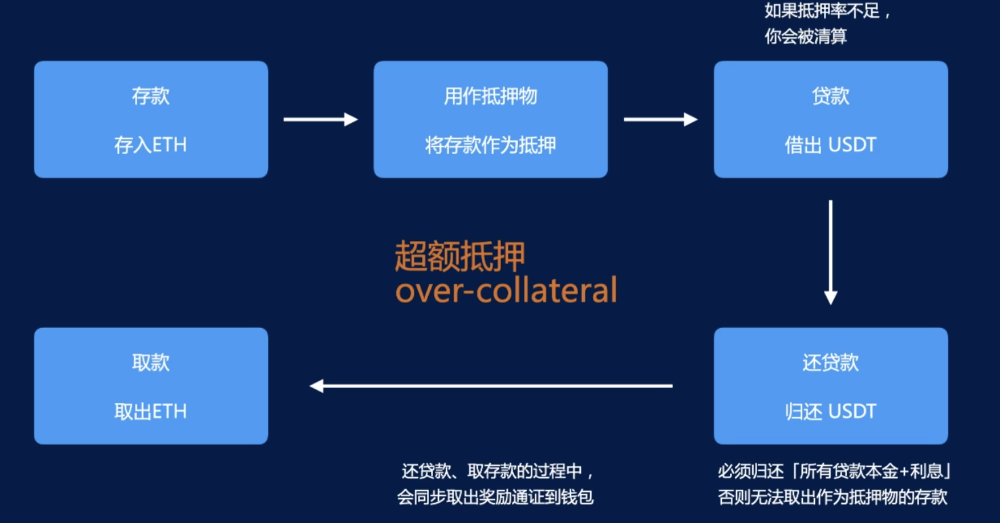

借贷业务。

区块链世界里没有信用借贷！无法保证借出的一定会归还，所以有一种全新的贷款方式，其核心逻辑是：**超额抵押(over-collateral)**！即存入时的抵押物价值低于贷款价值。

如当前存入的抵押物价值为 10w USD，那么当前可借出的钱也许只有 8w USD；如果抵押物的价格在上涨，假设过了段时间抵押物价值 20w，那么此时可借出的就是 16w 了；如果抵押物的价格在下降，假设过了段时间抵押物价值只有 8w，那么用户可能就会有清算的风险。

# Compound 借贷协议

[Compound](https://compound.finance)

三种角色：存款人(Supplier)、贷款人(Borrower)、清算人(Liquidator)。

Compound 会将所有即将抵押物价值不足的贷款信息公开，任何第三方都可以作为清算人去进行清算（Compound 现已不再提供页面进行清算操作，需要通过程序完成），清算人可以获得清算奖励（奖励的价值出自抵押物）。

> 由于是超额抵押，所以即使快被清算了抵押物的价值也是高于贷出的价值的。

借贷协议可以得到利差收益：贷款利息-存款利息

## 存款

存款到借贷协议，获得存款利息收入。

用户向【ETH 借贷市场智能合约】存入 ETH，智能合约向用户返回 cETH。

> cToken，存款凭证，是带利息的资产。示例：
> 
> start：supply 1ETH，get 47.6190cETH
> 
> end：redeem all cETH，get 1.047618ETH
> 
> 其中的 0.047618 就是利息

存款可获得【治理通证奖励】—— COMP 奖励。

## 贷款

在有信用额度的前提下，从借贷协议贷款，支付贷款利息。

用户从【USDT 借贷市场智能合约】借出 USDT，以自己在借贷协议中的 ETH 为抵押，归还时，需归还本金+贷款利息,否则无法取出作为抵押物的存款。

贷款可获得【治理通证奖励】—— COMP 奖励。

## 清算

假设 A 有价值 1w USD 的 ETH（当前 1ETH 价值 2000USD），存入借贷协议后，现在的抵押率(collateral factor)是 0.825，也就是说当前 A 可以借出 1w*0.825=8250 USD，而 A 现在借价值 8kUSD 的资产，贷款健康率为 8250/8k=1.03125，>1 说明是正常的超额抵押。

过了短时间，ETH 的价格跌到了 1800USD，此时抵押物的价值为 9kUSD，抵押率不变，即 A 理论上当前最多可借 9k*0.825=7425 USD，此时贷款健康率为 7425/8k=0.928125，<1 说明抵押物不足，就会被清算。

假设清算收益率为 8%。

- 理想情况：

清算人 B 还了 A 借出的价值 8kUSD 的资产，则 B 可以得到价值 8k*1.08=8640USD 的抵押物。

整体看，清算人 B 赚了 640USD；存款人 A 当前拥有 8k 的借款（无法还款）、剩余的价值 9k-8640=360 的抵押物（清算后返还给 A），共价值 8360。

- 实际情况：

有一个 close factor=0.5，会控制让 B 无法清算 A 所有的 8k 借款，最多只能清算 8k*0.5=4k。

那么，B 还了价值 4kUSD 的资产，得到 4k*1.08=4320USD 的抵押物。

此时 A 剩余的抵押物价值 9k-4320=4680USD，贷款健康率为 4680/4k=1.17，A 当前剩余的 4k 借款又变成了健康的贷款，不会再被清算了。

整体看，清算人 B 赚了 320USD；存款人 A 当前拥有 4k 的借款（无法还款）、4k 的借款还款后得到价值 9k-4320=4680 的抵押物，共价值 8680。

## 与其他 DeFi 协议的组合

- cToken 可以转让；
- cToken 可以抵押挖矿；
- （其他协议如 AAVE）可接受 DEX LP 作为抵押资产；
- （其他协议）为杠杆挖矿协议提供资金；
- （其他协议）为用户提供存、贷、挖矿综合服务

# 超额抵押前提的杠杆

> LP 挖矿：将两种资金组成 LP，然后质押获得收益。

杠杆挖矿：假设原本需要 ETH-USDT 这个 LP 交易对各 100USD 才能进行挖矿，现在只有价值 100USD 的 ETH 和 20USD 的 USDT，那么就可以将这些共计 120USD 的资产抵押给杠杆挖矿平台，贷出价值 80USD 的 USDT，这样就可以进行挖矿了，同时用户贷款需要付出利息，并承担风险，一旦资不抵债就会被清算。

这种方式在满足超额抵押的前提下给用户创造了一个机会，让用户可以利用一些杠杆来博取较大的收益。

(PancakeSwap 杠杆挖矿)[https://medium.com/alpaca-finance/leveraged-yield-farming-going-live-20f0497f4d52]
