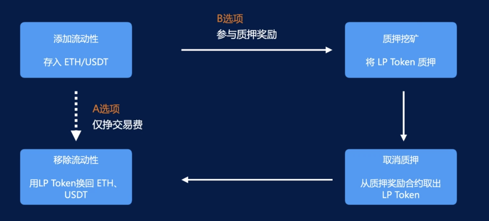

兑换业务。

# Uniswap

[Uniswap](https://uniswap.org/)、[Uniswap App](https://app.uniswap.org/)

流动性提供者 与 DEX 协议的交互步骤：

> 流动性提供者还可以将 LP Token 放入机枪池中让其帮忙复投质押。
> 
> 机枪池会将用户放入的 LP Token 去质押，然后每隔一段时间取消质押并取出奖励，然后进行复投，重复这个流程。
> 
> 资金少的话，每次操作都需要收取手续费会很贵，而机枪池会吸引大量的用户参与，从而聚合大量资金进行这些操作去获得收益。

Swap(兑换) 将【通证A】以市价换成【通证B】。

Swap 有两种角色：兑换者（用户）、流动性提供者(Liquidity Provider，LP)。

LP 向流动性池中存入【通证A】、【通证B】，得到 LP Token，为兑换提供流动性，获得交易费收入。

> LP Token 类似借贷业务中 Compound 的 cToken，也是带利息的资产。

兑换者向流动性池中，放入【通证A/B】，然后从池中得到【通证B/A】。

