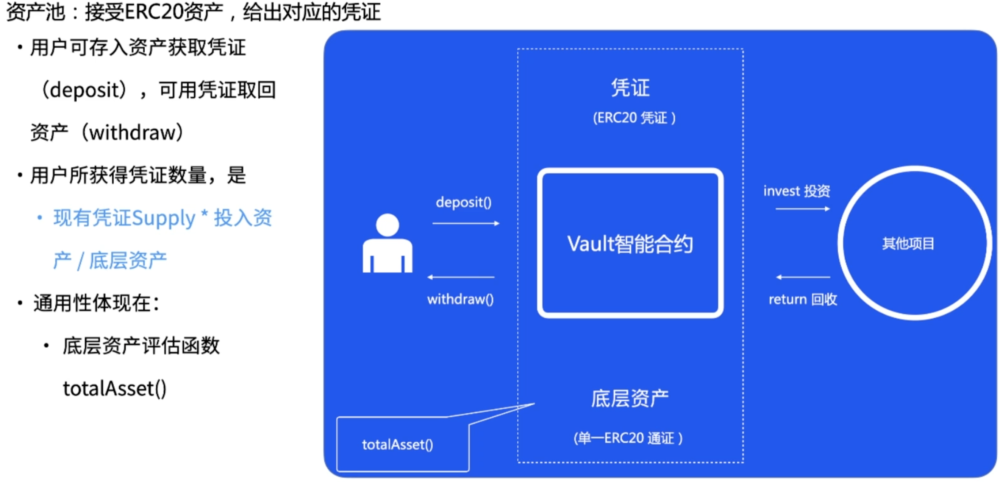

# AMM

自动做市商(Automated Market Maker，AMM)

## 恒定乘积做市商算法

智能合约会维护一个流动性池(Liquidity Pool)，池中包含了两种不同的资产（TokenA、TokenB）。

恒定乘积(Constant Product Market Maker)算法的数学模型：x * y = k，即保持流动性池中两种资产的乘积不变。同时池子中两种资产的价值也始终保持相等！

基本逻辑：有人买，价格上升；有人买，价格下跌。

> x，y 分别代表流动性池中两种资产的的数量，k 是常数
> 
> 也称为恒定函数做市商(Constant Function Market Makers，CFMM)

由于资产数量的变化和交易费用的存在，实际交易价格与用户预期价格之间可能会产生差异，这就是价格**滑点(Slippage)**，一般以百分比计算。

滑点 = (实际交易价格-预期交易价格)/预期交易价格 * 100%

流动性越大，滑点越小，即价格波动就越小。所以通常平台会去鼓励用户提供流动性。

## 交易时的数学计算

原始状态：x * y = k

兑换后的状态：x‘ * y’ = k，且 x' * xPrice = y' * yPrice

假设 x 是 TokenA 的数量，y 是 TokenB 的数量

假设以 TokenA 兑换 TokenB，则 x' 就是已知的，可以得到：y‘ = k / x’，从而可以得到给用户的 TokenB 数量 = y - y'

汇率 xPrice / yPrice = y' / x'

注意：当提供流动性时需要重新计算 x*y 的。

## 定价问题

AMM 只能产生交易价格，而无法发现市场价格！

为此，AMM 不得不引入套利者这一重要角色：一旦 AMM 平台上的价格与市场公允价格不同，就会出现套利空间，并将价格拉回正轨。

## 流动性提供者的收益与风险

流动性提供者的收益是从交易者每次 swap 的手续费中出的。

其风险则是需要承担无常损失：价格偏移后，带来的资产减少。

无常损失实际上来源于套利行为。上面提到，AMM 的交易价格与市场公允价格是脱轨的，为此需要套利者进来购买被低估的资产或卖出高估的资产，直到 AMM 提供的价格跟外部市场匹配。因此，套利者的利润实际上来自于流动性提供者，由于套利给流动性提供者带来损失的这一部分就被称为无常损失。

## Uniswap V3(TODO)

早期版本的设计目的是在整个价格范围 (0, +∞) 内提供流动性，易实现且可以有效聚合流动性，但会导致池子中的大部分资产从来没有动过，资金利用率较低。

考虑到这一点，更合理的方式应该是将流动性集中在价格范围小于 (0, +∞) 内，我们将流动性集中在优先范围内称为 position（仓位？）。一个 position 只需要维持足够的储备来保证其价格范围内的交易即可，

所以 V3 在提供流动性时可以指定资金的使用范围。

未完...

## Reference

[详解什么是AMM-自动做市商？](https://mp.weixin.qq.com/s?src=11&timestamp=1703232658&ver=4971&signature=GFbqTbu4pHRTnJAn5xg6fde2KN1yKGtENbWv*UzUxkPCkjUTRrz-TECK9A5KQ145iTLrhx98KuYbU0EYsqUp8o3yxiYcnneAS8CU3CkVvkRgbY3G78xgeBazJp1ilZDA)

[什么是自动做市商AMM，以及它们是如何经营的](https://zhuanlan.zhihu.com/p/409074055)

[Uniswap v3 白皮书](https://uniswap.org/whitepaper-v3.pdf)

# 合约

资产池合约 [ERC-4626](https://eips.ethereum.org/EIPS/eip-4626)：

