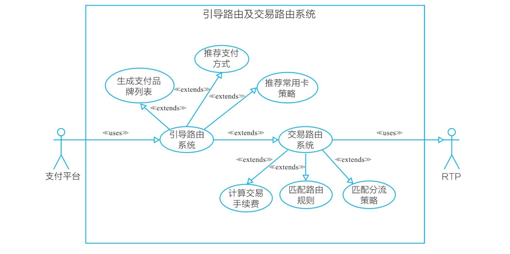

[《支付方法论》](https://item.jd.com/13699148.html)

[部分基础名词](../../biz/words_finance.md)

# 支付

支付就做三件事：交易、清分、结算。

交易是支付的前提和基础；清分是结算的数据准备和计算过程；结算是资产的交割，是资产转移的过程，是支付的完结。

- 交易(Transaction)：指引起债权债务关系的各类经济活动，包括商品市场、服务市场、劳务市场和金融市场的各类交易。

交易过程包括交易主体的合法性和身份确认、支付方式确认、支付通道的计算与决策、支付能力查证、交易报文组织、交易结果的落地存储与返回信息归类反馈、补偿机制处理等。

- 清分(Clearing)：指债权人和债务人的相关金融机构之间按照约定的规则，完成支付指令的交换，并计算出待清偿债权、债务结果，也就是支付过程参与方算费的过程。

清分是结算的数据准备阶段。这一步双方只是算出各自的应收与应付，并没有发生实际交割。

清分过程中，需要确保账务信息数据准确、账务对平，从而为后续债权债务提供数据支撑。这个过程包括交易信息落地和状态流转、将数据汇总后根据日切时间(上一个工作日结束的时间点)打包批次、差账异常数据处理、计算结算债权债务结果等。

- 结算(Settlement)：指根据清分的结果，债权人和债务人的相关 金融机构之间进行相应的账簿登记，完成货币资金或有价证券最终转 移的过程。

结算过程中，需要确保债权债务信息完整、状态符合流程，确保结算资金可用，确保记录并通知结算结果等。

## 支付架构

支付场景：凡是用到支付的业务场景。如零售、用车、机票、酒店等。

支付工具：进行货币债券转移的媒介。常见有API、 SDK、移动端、二维码、POS(Point Of Sale)支付等。

支付产品：根据支付方向和一定特性所提供的服务。常见的有代付产品、鉴权产品、主扫产品、被扫产品和收款产品。

支付系统的很多考虑方向：

- 接入（随着业务体量发展考虑）
  - 接入的时候要考虑接入安全，拒绝恶意或者未授权的调用，做好准入控制
  - 流量大请求多了后，进行分流与队列处理，以保证交易的高可用
  - 支付网关，对前端调用后端服务进行验证，进行流量控制、准入控制、安全控制等

- 支付请求处理（系统需要从支付成本、支付体验、支付风险、支付成功率等维度以及灾备处理方面进行综合考虑，以保证实现交易处理的最优解）
  - 在接入多个支付通道后，要考虑该怎么分配流量请求，于是有了路由系统
  - 当银行、卡组织或者第三方支付愿意贴补营销费用时，要考虑如何扣减和展示，于是有了营销系统
  - 当一笔订单有多个商品或者多种支付方式时，要考虑对于组合订单或者组合支付如何分账，于是有了订单系统、分账系统
  - 当用户的一些支付要素已经保存时，在保证安全的前提下，要考虑用户再次支付时如何进行反显或者省略输入以避免用户重复填写，进而提升转化率，于是有了常用卡系统。

- 对账问题
  - 人力的增长赶不上业务的增长，系统从最初的手工拉取账单变成系统自动生成，从每月对账变成每日对账，开始有了各种各样的系统来处理账单，比如计费系统、对账系统、结算系统、会计系统、差错处理系统、清分系统、对账文件服务等。这些系统一起构成了清结算系统，于是有了清算核心层

- 其他
  - 消息的推送与数据的统计和监控需要依赖各类服务来实现，如短信服务、通知服务、数据监控、数据统计，于是有了支撑服务
  - 为了方便一些业务查询与问题处理，如商户后台、报表后台、资金管理后台、业务运营和客服查询后台，于是有了内部运营后台
  - 为了方便一些服务的基础信息配置，如联行号、地理信息、行业信息、支付品牌、支付方式等，于是有了基础信息服务

# TODO支付通道

# TODO跨境支付

# 支付路由系统

注：这里将调用服务方都统一称为“支付平台”

支付路由系统是支付核心系统，对商户支付页面进行管理与输出、根据商户需求及通道特性基础对交易进行处理，并在此基础上对支付中的异常情况进行支付灾备处理。

路由系统的机制主要通过引导路由和交易路由共同运作：

- 引导路由用来决定用户看得到的，每个商户展示哪些支付品牌以及这些支付品牌的排序；
- 交易路由用来决定用户看不到的，每笔交易走什么支付通道

引导路由会向支付平台返回支付引导方案：

- 推荐支付方式：支付平台高亮推荐给用户支付方式
- 生成支付品牌列表：生成在支付产品下各个支付品牌的排列次序
- 推荐常用卡策略：向客户推荐常用卡的策略，如上次使用或成本优先

交易路由会想支付平台返回支付品牌所支持的支付通道方案，决策过程如下：

1. 计算交易手续费。交易路由系统调用计费模块，计算当前交易在每个可用通道中所需的手续费，并将通道按此次交易成本从低到高排序。
2. 匹配路由规则。交易路由系统根据交易请求，将可用通道按照路由算法优先级进行匹配，与规则匹配的目标通道会进行交易转发。
3. 匹配分流策略。如果交易需要分流，那么按分流策略进行转发。

## 引导路由

支付平台或者网关系统向服务请求获得所支持支付方式及品牌展示，然后服务对这个请求做出处理，并向商户返回涵盖支付方式及品牌、营销文案、推荐支付方式、常用支付习惯等信息的一揽子方案，这个服务被称为引导路由。

引导路由由三个模块组成：品牌列表、引导方案、引导规则。且三个模块依次进行。

## 交易路由

支付平台或者网关系统向服务请求可用通道，服务根据通道信息配置及规则优先级进行决策，向支付平台或者网关返回最优支付通道方案，这个服务被称为交易路由。

交易路由流程可以从两个纬度看： 

- 路由算法优先级：路由通道 -> 路由风控 -> 路由用户体验
- 路由调用节点：事前、事中、事后

### 路由算法优先级

- 基础路由算法：指根据配置规则匹配。

配置的规则是根据同一物理通道不同属性的具体内容进行配置，如不同支付品牌、交易类型、交易金额、限额、商户、计费方式和费率等。

- 分组路由算法：指有多个物理通道或者逻辑通道可用，根据分组规则中保量金额或者权重比例进行路由计算，分配交易至目标通道

分组路由主要是出于商业合作考虑，通过保证合作方交易量来保持长期稳定的合作。

- 短路路由算法：指有多个物理通道或逻辑通道可用时，匹配规则优先级最高的通道，不看费率，不看分组，忽略其他规则。

短路路由一般作用于以下三种情形：

1. 某通道不占优势，但是贴补营销费用后，用户或平台的整体体验或者收益反而最高
2. 某新通道上线，通道质量未知，所以不能全量放开，需要先选择某个行业下的具体小商户进行测试
3. 某通道不占优势，但却是重点战略合作客户和流量场景，需要在其流量场景里优先使用它的通道

- 风险路由算法：处理风险交易的路由机制。

在交易前，能够获取到用户信息、地理位置、设备信息、交易商户等信息，风控系统能够对人识别交易风险并处理。

其思路就是要么让风险交易的客户进行更多要素的验证，要么进行风险转移，将交易路由到通道服务商包赔通道。

将风险划分为不同级别，针对不同级别以及对其容忍度采用不同策略。

### 路由调用节点

- 事前路由：用户发起支付，支付平台为了向用户展示支付方式、银行、输入要素而向路由系统发起请求的过程。
- 事中路由：指在支付交易过程中，用户输入卡号、护照等支付要素，支付平台根据输入要素进行判定，若事前路由下发的最优通道不支持此交易(如不支持此卡BIN或者证件类型)，会再次请求路由服务，获得支持此要素的支付通道的处理机制。

> 绝大多数公司只做了事前路由，甚至只做了路由中的基础路由，这样仅仅能够解决能用的问题，要想不断提高支付成功率，就需要做事中路由。

- 事后路由：指在支付交易过程中，识别通道方返回的交易码，将一些因为通道方原因(如通道超限)造成的交易失败进行重试以挽回交易。

# 重试服务

重试服务产生的原因：

- 通道限额问题
- 通道服务异常问题，一般有两种解决办法
  - 采取补偿机制
  - 先把原交易置为失败，前端界面显示提示信息：建议用户重新支付
- 通道使用率问题

解决以上问题的方法或服务称为重试服务。重试服务是指对于支付交易失败，分析并返回失败原因，根据返回原因重新组织支付要素，上送给交易通道的处理机制。

重试服务的运转与应用核心在于两部分：重试服务自身的重试规则、路由系统针对重试服务的处理机制。

注：由于重试服务的存在，路由需要缓存支付订单号、风险结果、最优通道ID，留作后用！

## 重试服务设计

### 重试规则关键项

- 规则号
- 商户号
- 行业类型
- 支付通道
- 支付品牌
- 币种（CNY）
- 交易类型
- 适用响应码
- 使用渠道
- 流量控制
- 允许重试次数
- 系统最长等待时间
- 是否开启
- 生效时间

### 重试服务原则

- 参与对象一般只有银行卡类交易

通常账户类支付和储值卡的支付通道是唯一的，没有备份通道，为了避免后续路由进行无用计算，在重试规则这里就直接只配置支持银行卡类交易。

- 鉴权类交易、风险类订单交易、人工置失败交易、出款类交易不参与重试。

前三类好理解，而出款类交易是把资金款项付到客户账户，一旦资金进入客户账户，付款人就失去了对资金的控制权。如果此类型交易重试，会存在重复出款多笔的可能，进而造成资损。

- 参与重试通道响应码有要求

重试服务是在安全的前提下对能够通过重试挽救的订单进行重试，以提高成功率。基于这个目的，不安全的不能进行重试，明知道不成功的也不会进行重试。

系统里不参与重试的通道响应码示例：短信验证码错误、有效期错误、卡过期、卡无效、卡状态异常、卡余额不足等。

- 重试服务上送新通道之前，原则上原通道交易需要有个终态结果。

除了通道返回交易失败外，重试服务发生的场景还有系统间交互异常等原因造成的信息丢失，获取不到交易结果等失败。

需要先进行原有补偿机制处理，如冲正作废原交易或者查询原交易失败后再进行重试，否则很容易造成订单混乱、清结算账单对不平等问题。

## TODO路由重试服务设计

# TODO BIN服务

# TODO清结算
