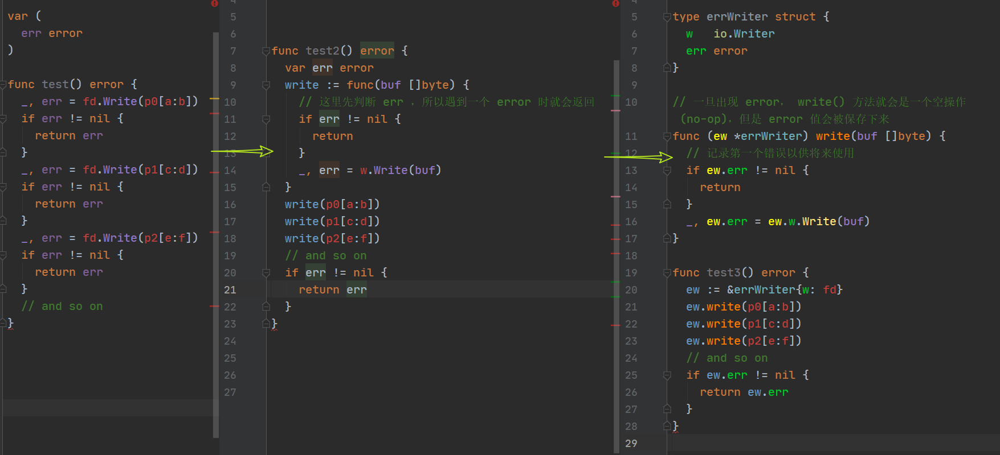

# 标准 errors 库

见[内置 errors 库](../../libs/builtin_errors/READEME.md)

# Errors are values

原文地址：[Errors are values](https://blog.golang.org/errors-are-values)

Values can be programmed, and since errors are values, errors can be programmed.

如 bufio 包中 `Scanner` 类型，其 `Scan()` 方法调用了底层 I/O，显然该方法会导致 error(注意，即使正常扫描完文件，也会产生 EOF - End of File 错误)，但是 `Scan()` 方法并不暴露 error，而是在扫描停止时(到达了文件末尾或产生 error)返回一个 bool 值，error 则会被记录，用户可以通过一个单独的方法 `Err()` 来查看扫描过程中的产生的 error，如果是 EOF 错误则 `Err()` 返回 nil。

```go
scanner := bufio.NewScanner(input)
for scanner.Scan() {
  token := scanner.Text()
  // todo process token
}
if err := scanner.Err(); err != nil {
  // todo process err
}
```

如果自定义一个 `func (s *Scanner) Scan() (token []byte, error)`，此时，上述代码也许会变为：

```go
scanner := bufio.NewScanner(input)
for {
  token, err := scanner.Scan()
  if err != nil {
      return err // or maybe break
  }
  // process token
}
```

这两者差别并不大，但是在后者中，用户必须在每次迭代后都检查 error，而在真正的 `Scanner` API 中，error 的处理被抽离出来了，代码逻辑会显得很自然：循环，直到结束，然后再处理 error。错误处理不会掩盖控制流。

 `Scanner` 的这种处理很简单，不同于到处写 `if err!=nil` 或要求用户在每个 token 后检查错误。这正是对 error 值的编程！示例：



实际上，这种模式在标准库中很常见，如 `archive/zip` 和 `net/http` 都用到了。而 `bufio` 包的 `Writer` 类型实际就是上面 `errWriter` 思想的实现，尽管其 `Write()` 方法返回了一个 error，这是为了实现了 `io.Writer` 接口，该方法的行为就像上面示例中的 `errWriter.Write()` 方法那样，再通过 `Flush()` 来报告 error：

```go
func test(){
  b := bufio.NewWriter(fd)
  b.Write(p0[a:b])
  b.Write(p1[c:d])
  b.Write(p2[e:f])
  // and so on
  if b.Flush() != nil {
      return b.Flush()
  }
}
```

这种方法有一个显著的缺点：对于一些应用而言，我们**无从得知在 error 产生之前完成了多少处理**。如果这一信息很重要，就需要更细粒度的方法了。不过，通常而言，在末尾处进行一次全部完成或全部未完成的检查就足够了。

# Eliminate error handling by eliminating errors

通过消除 error 来消除 error 处理。

原文地址：[Eliminate error handling by eliminating errors](https://dave.cheney.net/2019/01/27/eliminate-error-handling-by-eliminating-errors)

[代码示例1](./countLines.go) 中 `bufio.Scanner` 对 `bufio.Reader` 增加了抽象层以便消除了 CountLinesBefore 中的错误处理。

[代码示例2](./eliminate_error_test.go)

# github.com/pkg/errors 的使用！

https://pkg.go.dev/github.com/pkg/errors

[代码示例](./wrap_error_test.go)
