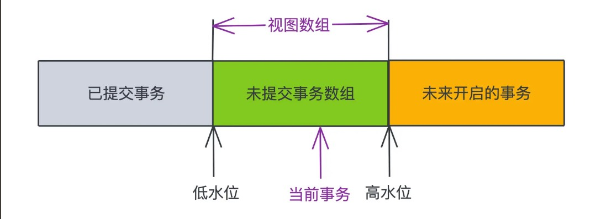
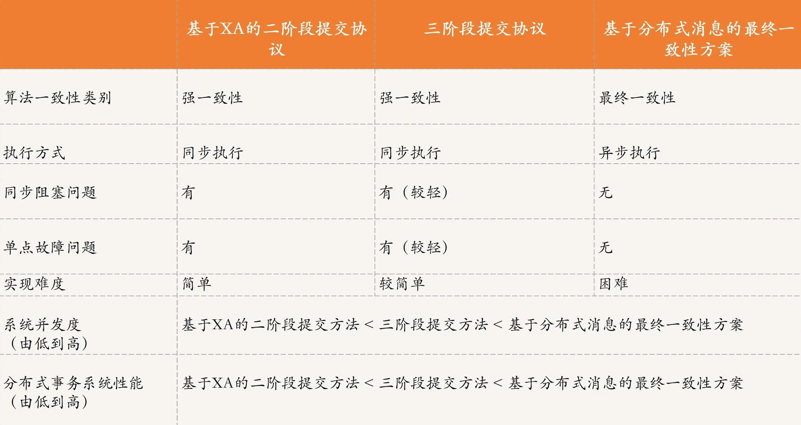
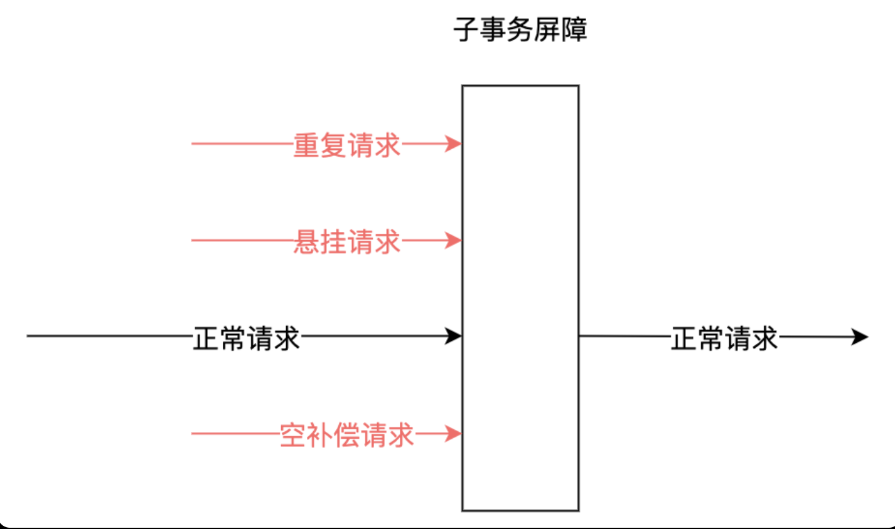

事务（transaction）是为了保证一组操作，要么全部成功，要么全部失败。

事务的四个特性（ACID）：

- Atomicity（原子性）：一个事务内的所有操作是一个整体，要么全部成功，要么全失败；
- Consistency（一致性）：事务提交或回滚后，数据库的完整性约束不能被破坏；
- Isolation（隔离性）：一个事务在提交之前，对其他事务都是不可见的；
- Durability（持久性）：事务提交之后对数据的修改是持久性的

# MySQL 事务

MySQL 的事务是在引擎层实现的。以下如不特殊说明均是指 InnoDB 存储引擎下的特性和实现！！

InnoDB 引擎通过[ redolog 的 crash-safe 能力](./05_persistence.md#wal-以及-redolog-的-crash-safe-能力)以及[两阶段提交](./05_persistence.md#两阶段提交)保证了事务的持久性！

## 事务的隔离性

当数据库中有多个事务并发同时访问相同的数据时，可能会出现以下问题：

- 脏读（dirty read）
    - 事务 A 读取了已被 B 更新但还未提交的字段，之后，若 B 回滚，A 读取的内容就是无效的
- 不可重复读（non-repeatable read）
    - 事务 A 先读取了一个字段还未提交，然后 B 修改/删除了该字段，之后，A 中再次读取该字段，值就不同了
- 幻读（phantom read）
    - 事务 A 从表中查询符合条件的数据没有读到，A 尚未提交，然后 B 在该表中插入一些新的行并提交，之后，如果 A 再次读取就读到了

为了解决这些问题，就有了"隔离级别"的概念。

SQL 标准的事务隔离级别：

- 读未提交（Read Uncommitted）：允许事务 B 看到事务 A 尚未提交变更
- 读已提交（Read Committed）：只允许事务 B 看到事务 A 已提交的变更
- 可重复读（Repeatable Read）：事务 B 执行过程中看到的数据总是与事务 B 启动时看到的一致，且事务 A 未提交的变更对事务 B 是不可见的
- 串行化（Serializable）：对于同一行记录，“写”会加“写锁”，“读”会加“读锁”。当出现读写锁冲突的时候，后访问的事务必须等前一个事务执行完成，才能继续执行

| 隔离级别（✓ 代表可以解决该问题） | 脏读  | 不可重复读 | 幻读  |
|-------------------|-----|-------|-----|
| 读未提交              | ×   | ×     | ×   |
| 读已提交              | ✓   | ×     | ×   |
| 可重复读              | ✓   | ✓     | ×   |
| 串行化               | ✓   | ✓     | ✓   |

MySQL 支持 4 种事务隔离级别，默认的事务隔离级别是 "Repeatable Read"，Oracle 默认 "Read Committed"。

| 事务 A        | 事务 B      |
|-------------|-----------|
| 启动事务，查询值为 1 | 启动事务      |
|             | 查询值为 1    |
|             | 将 1 修改为 2 |
| 查询得到值 v1    |           |
|             | 提交事务      |
| 查询得到值 v2    |           |
| 提交事务        |           |
| 查询得到值 v3    |           |

假设隔离级别是"读未提交"，则 `v1 = 2, v2 = 2, v3 = 2`；
假设隔离级别是"读已提交"，则 `v1 = 1, v2 = 2, v3 = 2`；
假设隔离级别是"可重复读"，则 `v1 = 1, v2 = 1, v3 = 2`；
假设隔离级别是"串行化"，则 `v1 = 1, v2 = 1, v3 = 2`。

## MVCC

MVCC(Multi-Version Concurrency Control，多版本并发控制)指的是在使用 读已提交、可重复读 两种隔离级别的事务执行普通的 `SELECT` 操作时，访问记录的版本链的过程。

通过数据行的多个版本管理来实现数据库的并发控制。其主要思想：保存数据的历史版本，然后通过对比版本号来决定某个版本的数据是否显示出来，读取数据时不需要加锁就可以保证事务的隔离效果。

### 几个基本概念

- 事务 ID(trx_id)：用于标识事务，是一个自增的序号，每个事务开始前就会申请一个
- 隐藏列：InnoDB 的叶子节点存储了数据页，数据页中保存了行记录，而在行记录中还有一些重要的隐藏字段
    - row trx_id，记录该行数据的当前版本是在那哪个事务中被修改的
    - roll_pointer，一个指向更早记录值的指针
- undo log：回滚日志，记录了事务开始前的状态，用于事务失败时回滚；还用于实现 MVCC
    - 上面的 roll_pointer 指向的其实就是 undo log 的记录
    - 由于 roll_pointer 的存在，数据表中的每一行记录都可能有多个版本，每个版本有自己的 row trx_id，而 undo log 中同一行记录的多个版本通过指针形成了一个链表，即版本链

> 如果在创建的表没有显式指定主键，且表中没有定义 `NOT NULL` 的 UNIQUE 索引，那么 InnoDB 会自动在表中添加一个 row_id 的隐藏列作为主键。

- 快照读：select 时会按照一定规则从版本链中选择一个合适的版本（不一定是最新值）读出来，就像一个快照
- 当前读：读的就是记录的最新值

### Read View 读视图/一致性视图

多个事务对同一个行记录进行更新会在 undo log 中产生多个历史快照，当前事务通过 Read View 并根据一定的规则来判断自己要读取哪个版本的行记录。

Read View 记录了当前事务开启时所有活跃（开启了事务但未提交）的事务列表，即下图中的视图数组。



Read View 中包含了：

- 低水位 min_trx_id = 视图数组中最小的事务 ID
- 高水位 max_trx_id = 视图数组中最大的事务 ID + 1
- 活跃事务数组为 m_ids
- creator_trx_id 代表生成该 ReadView 的事务 id

对于当前事务的启动瞬间而言，一个数据版本的 row trx_id 有以下几种可能：

1. row trx_id == creator_trx_id,说明当前事务在访问自己之前修改过的值，因此这个行记录的最新值对当前事务是可见的；
2. row trx_id < min_trx_id，说明这个行记录在那些活跃事务创建前就提交了，因此这个行记录的最新值对当前事务是可见的；
3. row trx_od > max_trx_id，说明这个行记录是在这些活跃事务创建后才创建的，因此这个行记录的最新值对当前事务是不可见的；
4. min_trx_id < row trx_id < max_trx_id，还有两种情况
    1. row trx_id 在 m_ids 中，说明这个行记录是由尚未提交的事务生成的，因此这个行记录的最新值对当前事务不可见
    2. row trx_id 不在 m_ids 中，说明生成这个行记录的事务虽然不是最早开始的，但是结束的比 m_ids 中的事务早，以至于当前事务开始时，它已经提交了，因此这个行记录的最新值对当前事务可见

### 查询流程

1. 获取事务自己的 trx_id
2. 获取 Read View
3. 查询得到的数据，将 row trx_id 与 Read View 对比
4. 如果该数据的最新值对当前事务不可见，通过该数据的 roll_pointer 和 undo log 通过类似链表的遍历操作来获取历史快照
5. 返回符合规则的数据

通过这种方式，当事务开启后，无论事务什么时候查询，看到的数据结果都是一致的，所以称为**一致性读**。

我们知道，InnoDB 存储引擎只有主键索引是聚簇索引，记录了完整的数据行，也就是说，在二级索引（即非聚簇索引）中是没有 trx_id、roll_pointer 隐藏列的，如果查询语句使用二级索引来执行查询的话，如何判断可见性呢？

在二级索引数据页的 Page Header 部分有一个 PAGE_MAX_TRX_ID 的属性，记录了修改该二级索引页面的最大事务 ID，所以，当查询语句访问二级索引时，

1. 判断 Read View 的 min_trx_id 是否大于 PAGE_MAX_TRX_ID，如果是，则说明该页面中的所有记录都对该 Read View 可见
2. 如果 min_trx_id < PAGE_MAX_TRX_ID，利用二级索引记录中的主键值进行回表操作，得到完整的行记录后再按照上面的方式判断可见性。

### 更新流程

假设在 A 开启前，仅存在一个活跃事务（trx_id = 99），且 id=1 的这一行数据的 row trx_id = 90，value = 1。

| 事务 A                             | 事务 B                                | 事务 C                                              | id=1 的行记录                 |
|----------------------------------|-------------------------------------|---------------------------------------------------|---------------------------|
| `begin`，trx_id = 100             |                                     |                                                   | value=1，row trx_id = 90   |
|                                  | `begin`，trx_id = 101                |                                                   | value=1，row trx_id = 90   |
|                                  |                                     | `UPDATE table SET k=k+1 WHERE id=1`, trx_id = 102 | value=2, row trx_id = 102 |
|                                  | `UPDATE table SET k=k+1 where id=1` |                                                   | value=3, row trx_id = 101 |
|                                  | `SELECT k FROM table where id=1`    |                                                   |                           |
| `SELECT k from table WHERE id=1` |                                     |                                                   |                           |
| `commit`                         |                                     |                                                   |                           |
|                                  | `commit`                            |                                                   |                           |

注意，事务 C 先提交，生成了 row trx_id = 102 的版本，而事务 B 在 `UPDATE` 之前由于 B 的 trx_id = 101，其活跃数组为 [90, 100, 101]，而 id=1 的行记录 row trx_id = 102，所以最新的值 value=2 对事务 B 而言是不可见的，此时，如果
B 先 `SELECT` 的话，得到值是 value = 1。

但是！更新操作时会有一条特殊的规则：**更新数据都是先读后写的，而这个读，只能读当前最新的值，也就是"当前读"**。

因此，`UPDATE `的时候，先拿到 value=2 的值，然后再更新成 value=3 的版本。

而事务 B 中在 `UPDATE` 后面的那条 `SELECT` 语句查到当前最新版本为 value=3，且 row trx_id =
101，正好是自己的更新，可以直接使用，所以 `SELECT` 到的值为 3！！

除了 `UPDATE` 语句外，`SELECT` 语句如果加锁的话，也是当前读！如 `SELECT xxx FOR UPDATE` 也可以读到当前最新的值。

在 `SELECT` 的情况下，如果没有加 `FOR UPDATE` 的话就不会发生幻读，反之则会出现幻读的现象！！！

## 隔离级别的实现

- "读未提交"：直接返回记录上的最新值即可；
- "串行化"：直接使用加锁的方式来实现，性能很低。

而"读已提交"、"可重复读"两种隔离级别是借助视图(View) 实现的！！访问的时候以视图的逻辑结果为准。

- "可重复读" 的核心就是一致性读，会在事务第一次读取数据时创建一个视图，整个事务存在期间都使用这一个视图
    - 而事务更新数据的时候，只能使用当前读，如果当前记录的行锁被其他事务占用的话，就需要进入锁等待了
- "读已提交"隔离界别下，每次读取数据前都会创建一个新的视图

## 两种视图

在 MySQL 中有以下两种视图：

- view，用查询语句定义的虚拟表
- InnoDB 在实现 MVCC 时用的**一致性读视图（consistent read view）**，用于支持读已提交和可重复读的隔离级别的实现。
    - 一致性读视图没有物理结构，作用是事务执行期间用来定义“我能看到什么数据”。

# Redis 事务

Redis 提供了 `MULTI`、`EXEC` 两个命令，并通过三个步骤来实现事务：

1. Client 使用 `MULTI` 命令显式开启事务；
2. Client 把事务中要执行的一系列操作发送给 Redis 实例，Redis 实例会将这些命令暂存到一个命令队列中，而不会立刻执行；
3. Client 使用 `EXEC` 命令提交事务，让 Redis 实例执行第二步暂存的所有命令；当然 Client 也可以使用 `DISCARD` 命令来取消事务，则暂存的所有命令会被清空。

```shell
$ MULTI
OK
$ SET Book_Name "Git Pro"
QUEUED 
$ SADD Program_Language "C++" "C#" "Jave" "Python" "Golang"
QUEUED
$ GET Book_Name
QUEUED
$ EXEC
1) OK
2) (integer) 4
3) "Git Pro"
```

Redis 并没有提供事务的回滚机制！

## 事务特性的支持

Redis 的事务无法完全保证事务的原子性！可以将所有的命令放入 Lua 脚本中。

- 事务操作入队的命令存在错误（如语法错误，命令不存在）
    - 入队时 Redis 会保存并记录该错误，这是还是可以正常提交命令的，而到了实际执行时 Redis 就会拒绝执行所有提交的命令操作，返回事务失败的结果，这种情况是可以保证原子性的；
- 事务操作入队时命令和操作的数据类型不匹配，但 Redis 没有检查出来错误。
    - 实际执行时，Redis 会对这些错误的命令报错，但是正确的命令还是会执行，此时就**无法保证事务的原子性**了！
- Redis 开启了 AOF 日志，在执行事务的 EXEC 命令时，Redis 实例发生了故障，导致事务执行失败。
    - 此时只有部分事务操作被记录到了 AOF 日志中，使用 redis-check-aof 工具检查 AOF 日志文件，可以把未完成的事务操作从 AOF 文件中去除。这样一来，我们使用 AOF 恢复实例后，事务操作不会再被执行，从而保证了原子性。

Redis 的事务可以保证事务的一致性。

Redis 的事务可以保证事务的隔离性。

- 并发操作在 `MULTI` 前执行，隔离性的保证是通过 WATCH 机制实现的，否则隔离性无法保证
    - 此时事务操作的命令暂存在命令队列中，如果有其他的并发操作，需要看事务是否使用了 WATCH 机制，如果使用了，则可以保证隔离性，未使用则无法保证
- 并发操作在 `MULTI` 后执行，隔离性可以保证
    - Redis 使用单线程执行命令，`EXEC` 执行后，Redis 会保证先把命令队列中的所有命令执行完。所以，在这种情况下，并发操作不会破坏事务的隔离性

Redis 的事务无法保证事务的持久性！

- 如果 Redis 没有使用 RDB 或 AOF，那么事务的持久化属性肯定得不到保证
- 如果 Redis 使用了 RDB 模式，那么，在一个事务执行后，而下一次的 RDB 快照还未执行前，如果发生了实例宕机，这种情况下，事务修改的数据也是不能保证持久化的
- 如果 Redis 采用了 AOF 模式，因为 AOF 模式的三种配置选项 no、everysec 和 always 都会存在数据丢失的情况，所以，事务的持久性还是得不到保证。

### WATCH 机制

WATCH 机制是由 `WATCH` 命令实现的。

会在在事务执行前，监控一个或多个键的值变化情况，当调用 `EXEC` 命令执行事务时，WATCH 机制会先检查监控的键是否被其它客户端修改了。

如果修改了，就放弃事务执行，避免事务的隔离性被破坏。然后，客户端可以再次执行事务，此时，如果没有并发修改事务数据的操作了，事务就能正常执行，隔离性也得到了保证。

```shell
$ WATCH balance wallet  # 监控 balance、wallet 两个 key
OK
$ MULTI
OK
$ DECRBY balance 20 # balance-20
QUEUED
$ INCRBY debt 20 # debt+20
QUEUED
$ EXEC # 如果在事务期间上面监控的任何一个 key 被其他 Client 修改了，放弃事务！返回失败
```

# 分布式事务

分布式事务，就是在分布式系统中运行的事务，由多个本地事务组合而成。

为了应用分布式环境中的复杂场景，分布式事务无法保证 ACID 中的强一致性(C)，于是出现了 BASE 理论，其关键点在于使用最终一致性代替了强一致性！

> 基本可用（Basically Available）：分布式系统在出现故障的时候，允许损失部分可用性，即保证核心可用；
> 
> 柔性状态（Soft state）：允许系统存在中间状态，而该中间状态不会影响系统整体可用性；如数据库读写分离，主库向从库同步时会有一个延时，就是一种柔性状态
> 
> 最终一致性（Eventually consistent）：系统中的所有数据副本经过一定时间后，最终能够达到一致的状态。

分布式事务的实现：

- 基于 XA 协议的二阶段提交协议方法，强一致性，遵从 ACID 理论
- 三阶段提交协议方法，强一致性，遵从 ACID 理论
- 基于消息的最终一致性方法，最终一致性，遵从 BASE 理论



## 2PC

**两阶段提交是跨系统维持数据逻辑一致性时常用的一个方案**，如 Kafka 的事务消息、[MySQL InnoDB 引擎的 redolog](./05_persistence.md#两阶段提交)都会使用两阶段提交。实现和下面的不太一致

XA 是一个分布式事务协议，规定了事务管理器和资源管理器接口。事务管理器相当于协调者(Coordinator)，负责各个本地资源的提交和回滚；而资源管理器就是分布式事务的参与者(Cohort)，通常由数据库实现，比如 Oracle、DB2 等商业数据库都实现了 XA 接口。

基于 XA 协议的二阶段提交方法中，二阶段提交协议（Two-phase Commit Protocol，2PC），用于保证分布式系统中事务提交时的数据一致性。

2PC 的执行过程分为投票(Voting)、提交(Commit) 两个阶段。

- Voting：Coordinator 向 Cohort 发起执行操作的 CanCommit 请求，并等待 Cohort 的响应。Cohort 收到请求后，执行请求中的事务操作，将操作信息记录到事务日志中但不提交（即不会修改 DB 中的数据），Cohort 执行成功向 Coordinator 发送 "Yes"，不成功则发送 "No"。
- Commit：所有 Cohort 都返回结果后，进入 Commit 阶段，Coordinator 根据所有参与者返回的信息向 Cohort 发送 DoCommit 或 DoAbort 指令，规则如下
  - Coordinator 收到的都是 "Yes"，则向所有 Cohort 发送 "DoCommit"，Cohort 收到 "DoCommit" 消息后，完成剩余操作（如修改 DB 中数据）并释放资源（整个事务过程中占用的资源），然后向 Coordinator 返回 "HaveCommitted" 消息
  - Coordinator 收到的消息中包含 "No"，则向所有 Cohort 发送 "DoAbort"，此时 Voting 阶段发送 "Yes" 的消息的 Cohort 会根据之前执行操作的事务日志对操作进行回滚，然后所有 Cohort 向 Coordinator 发送 "HaveCommitted" 消息
  - Coordinator 收到来自所有 Cohort 的 "HaveCommitted" 消息后，意味着整个事务结束了  

2PC 尽量保证了数据的强一致性，但有以下几个问题：

- 同步阻塞：执行过程中，所有参与节点都被事务阻塞，所以不支持高并发场景
- 单点故障：一旦 Coordinator 发生故障，整个系统都处于停滞阶段
- 数据不一致：Commit 阶段，当 Coordinator 发送 "DoCommit" 请求时，如果发生局部网络异常，或 Cohort 发生了故障，就会导致只有一部分 Cohort 收到了请求并提交。

## 3PC

三阶段提交协议（Three-phase Commit Protocol，3PC），是 2PC 的改进。为了更好地处理 2PC 的同步阻塞和数据不一致问题，3PC 引入了**超时机制和准备阶段**。

3PC 的执行过程分为 CanCommit、PreCommit、DoCommit 三个阶段。

- CanCommit：Coordinator 向 Cohort 发送 "CanCommit"，询问是否可以执行事务提交操作，并等待 Cohort 的响应。Cohort 回复 "Yes" 或 "No"
- PreCommit：Coordinator 收到所有 Cohort 回复后，根据回复情况决定是否可以进行 PreCommit 操作。该阶段保证了在 DoCommit 之前所有参与者状态一致。
  - 都是 "Yes"，Coordinator 会执行事务的预执行
    - Coordinator 向 Cohort 发送 PreCommit 请求，进入预提交阶段；Cohort 收到 PreCommit 请求执行事务操作，并将 Undo 和 Redo 信息记录到事务日志中，Cohort 成功执行则返回 Ack 响应
  - 收到任意一个 "No" 或等待超时，就执行中断事务的操作
    - Coordinator 向 Cohort 发送 "Abort" 消息，Cohort 收到 "Abort" 或超时后仍未收到 Coordinator 的消息，执行事务的中断操作
- DoCommit：根据 PreCommit 阶段 Coordinator 发送的消息，进入提交或中断阶段
  - 提交阶段
    - Coordinator 收到所有 Cohort 的 Ack 响应，向所有 Cohort 发送 DoCommit 罅隙，开始执行提交阶段
    - Cohort 收到 DoCommit 消息，正式提交，完成后释放锁住的资源，并向 Coordinator 发送 Ack 响应
    - Coordinator 收到所有 Cohort 的 Ack 响应后，完成事务
  - 中断阶段
    - Coordinator 向所有 Cohort 发送 Abort 请求
    - Cohort 收到 Abort 后，利用其在 PreCommit 阶段记录的 Undo 信息执行事务回滚操作，释放锁住的资源，并向 Coordinator 发送 Ack 响应
    - Coordinator 收到所有 Cohort 的 Ack 响应后，执行事务的中断，并结束事务

2PC 仅在 Coordinator 引入了超时机制，而 3PC 在 Coordinator 和 Cohort 都引入了超时机制，如果 Coordinator 或 Cohort 规定的时间内没有接收到来自其他节点的响应，就会根据当前的状态选择提交或者终止整个事务，从而减少了整个集群的阻塞时间，在一定程度上减少或减弱了 2PC 中出现的同步阻塞问题；
引入了一个准备阶段，相当于预提交阶段，在这一阶段尽可能排除一些不一致的情况，保证在最后提交之前各参与节点的状态是一致的。

3PC 仍存在数据不一致问题：如在 DoCommit 阶段，部分 Cohort 已经收到 Ack 开始提交，部分 Cohort 由于网络不同未收到，最终导致数据不一致。

## TCC

TCC（Try-Confirm-Cancel） 又称补偿事务，针对每个操作都要注册一个与其对应的确认和补偿（撤销操作）。

- Try 操作做业务检查及资源预留
- Confirm 做业务确认操作
- Cancel 实现一个与 Try 相反的操作即回滚操作。

对于应用的侵入性很强，业务逻辑的每个分支都需要实现以上三种操作，

## 事务消息

2PC 和 3PC 核心思想均是以集中式的方式实现分布式事务，这两种方法都存在两个共同的缺点，一是，同步执行，性能差；二是，数据不一致问题。

基于消息的最终一致性方案，将需要分布式处理的事务通过消息或者日志的方式异步执行，消息或日志可以存到本地文件、数据库或消息队列中，再通过业务规则进行失败重试。

该方案的事务处理，会引入消息中间件，用于在多个应用间进行消息传递。

基于分布式消息的最终一致性方案采用消息传递机制，并使用异步通信的方式，避免了通信阻塞，从而增加系统的吞吐量。同时，这种方案还可以屏蔽不同系统的协议规范，使其可以直接交互。

利用 MQ 主要解决的是消息生产者和消费这的数据一致性问题！

示例：用户在电商 APP 购物，先将商品添加到购物车，然后多件商品一起下单支付，完成购物流程。

其中，订单系统创建订单后删除购物车的操作可以通过 MQ 来异步处理。订单系统在订单库中创建订单并发送消息给消息队列，而购物车系统订阅相应的 Topic，接受消息然后清理购物车。

期间可能会出现订单数据和购物车数据不一致的情况，如创建了订单但没有清理购物车、订单创建失败，但购物车中的商品却被清掉了。

对于购物车系统收到消息然后清理购物的操作，失败的处理比较简单，只在成功执行购物车清理后再提交消费确认即可，如果失败，由于未提交消费确认，MQ 会自动重试。

问题的关键在于订单系统的创建订单、发送消息两个步骤如何保证原子性（全部成功或全部失败）？

> 事务消息需要 MQ 提供功能才能实现，Kafka、RocketMQ 都提供了事务相关的功能。

1. 订单系统在 MQ 上开启一个事务，然后订单系统给消息服务器发送一个"半消息"（包含了完整的消息内容，但在事务提交之前，对于消费者而言，该消息是不可见的）；
2. 半消息发送成功后，订单系统就可以执行本地事务了，创建订单记录并提交订单库的数据库事务，然后根据本地事务的执行结果决定提交或回滚事务消息
   1. 如果订单创建成功，提交事务消息，购物车系统就可以消费到这条消息继续后面的流程
   2. 如果订单创建失败，回滚事务消息，购物车系统就不会收到这条消息了

那么，如果在最后提交事务消息时失败了怎么办？

- Kafka 会直接抛出异常，让用户自行处理； 
- RocketMQ 增加了事务反查机制来解决这个问题，如果 Broker 没有收到提交或回滚的请求，就会定期去 Producer 上反查这个事务对应的本地事务的状态，根据状态来决定提交还是回滚。

> 为了支撑事务反查机制，业务代码需要实现一个反查本地事务状态的接口。如根据消息中的订单 ID 在数据库中查询订单是否存在，存在则返回成功，否则返回失败。

记得做[消费幂等](https://github.com/fms5cmS/Note/blob/master/Advance/MQ/README.md)！

## 分布式事务的挑战

分布式事务是分布式的系统，也会遇到 [NPC 问题](./10_SomeMicroServiceNode.md)，而由于并不涉及时间戳，所以主要困扰是 NP。

以 TCC 为例，NP 可能会引入分布式事务中的两个难题：

- 空补偿：Cancel 执行时，Try 未执行。
  - 事务分支的 Cancel 操作需要判断出 Try 未执行，这时需要忽略 Cancel 中的业务数据更新，直接返回。
- 悬挂：Try 执行时，Cancel 已执行完成。
  - 事务分支的 Try 操作需要判断出 Cancel 已执行，这时需要忽略 Try 中的业务数据更新，直接返回。

分布式事务还有一类需要处理的常见问题就是重复请求：

- 幂等：由于任何一个请求都可能出现网络异常，出现重复请求，所有的分布式事务分支操作，都需要保证幂等性。

通常建议的处理方案："先查后改"

- 空补偿：服务设计时，需要允许空补偿，即在没有找到要补偿的业务主键时，返回补偿成功，并将原业务主键记录下来，标记该业务流水已补偿成功。
- 防悬挂：需要检查当前业务主键是否已经在空补偿记录下来的业务主键中存在，如果存在则要拒绝执行该笔服务，以免造成数据不一致

但是，这种方案在并发情况下容易掉坑里，问题场景描述：

1. 正常顺序夏，Try 执行时，在查完没有空补偿记录的业务主键后，事务提交前，如果发生了进程暂停（P），或事务内部进行网络请求出现拥塞，导致本地事务等待较久；
2. 全局事务超时，Cancel 执行，由于没有查到要补偿的业务主键，因此判断为空补偿，返回；
3. Try 进程暂停结束后，提交本地事务；
4. 全局事务回滚完成后，Try 的业务操作没有被回滚，产生了悬挂。

解决这一类问题的关键点是利用唯一索引，"以改代查"来避免竞态条件。

## DTM（Distributed Transactions Manager）

[DTM](https://dtm.pub) 是一个分布式事务框架，使用了子事务屏障技术来解决分布式事务中的异常问题，达到以下效果：



子事务屏障原理：在本地数据库，建立分支操作状态表 dtm_barrier，唯一键为全局事务id-分支id-分支操作（try|confirm|cancel）

1. 开启本地事务；
2. 判断当前操作 op(try|confirm|cancel)
   - 无论是那种操作，都先 `insert ignore` 一条数据 gid-branchid-op，如果插入不成功，提交事务返回成功（常见的幂等控制方法，防止重复执行）
   - 如果当前操作是 Cancel，那么再 `insert ignore` 一条数据 gid-branchid-try，如果插入成功（注意是成功），则提交事务返回成功
3. 调用屏障内的业务逻辑，如果业务返回成功，则提交事务返回成功；如果业务返回失败，则回滚事务返回失败

> insert ignore 语句:
> 
> 如果数据库中没有数据就插入新数据，插入成功;
> 
> 如果数据库中已有某条数据，则跳过这条数据，注意，此时会有警告，且插入不成功

在此机制下，解决了乱序相关的问题

- 空补偿控制-- 如果 Try 没有执行，直接执行了 Cancel，那么 2 中 Cancel 会先插入 gid-branchid-cancel 成功，然后插入 gid-branchid-try 也会成功，不走屏障内的逻辑，保证了空补偿控制
- 幂等控制-- 2 中任何一个操作都无法重复插入唯一键，保证了不会重复执行
- 防悬挂控制-- Try 在 Cancel 之后执行，先是 Cancel 插入  gid-branchid-cancel 和 gid-branchid-try 均成功，然后 Try 再次插入 gid-branchid-try 时不成功，提交事务返回成功，就不执行屏障内的逻辑，保证了防悬挂控制

DTM 的分布式事务控制需要全局事务 id，且需要额外增加 DTM 的服务。

