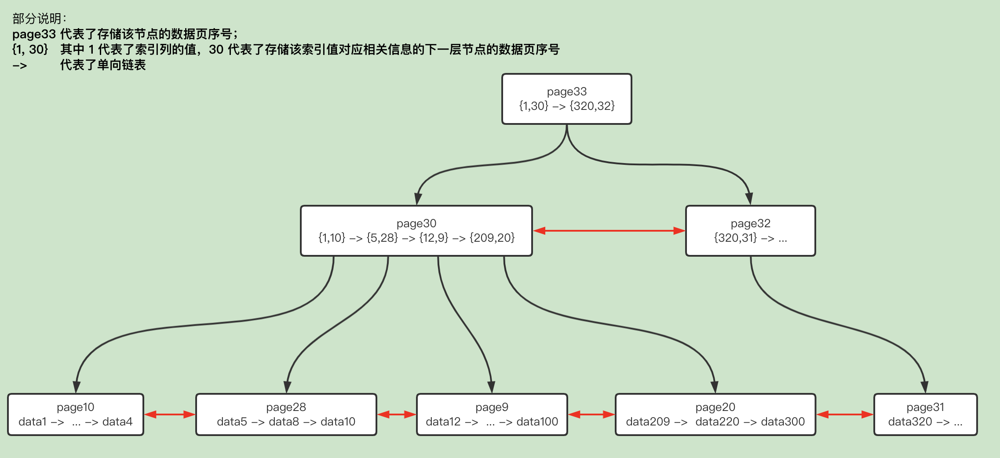

索引的出现是为了提高数据查询的效率，就像书的目录一样。

# 索引的常用数据类型

- 哈希表

适用于只有等值查询的场景中，存储数据时需要处理哈希冲突的问题，其所存储的数据是无序的，且不支持范围查询、排序、模糊查询。

[当数据量特别大同时又要求查询效率高时，也会考虑使用哈希表](./06_hash.md)。

> InnoDB 在某些情况下也会使用哈希索引，见后**

- 有序数组

等值查询和范围查询的场景中性能都很优秀，不过只适合静态存储引擎，有序数组在插入数据时维护有序性的成本较高。

- 红黑树

如果在内存中的话，红黑树的查找效率比 B-树更高，但是如果涉及到磁盘操作的话，B-树则是更优选择，因为红黑树是二叉树，数据量大时树的高度也会很高，而从根结点向下查找的过程中，每读取一个节点就相当于一次 I/O 操作，所以红黑树的 I/O 操作会比 B-树多很多。

- B-树（Balance Tree）、B+树

二者都是多路平衡树。

1. B+树中间节点不保存数据，只做搜索，所有数据都保存在叶子节点上，相同大小的磁盘页可以保存更多的节点，查询时所需 IO 次数更少；
2. B+树的查询必须最终查找到叶子节点，而 B-树找到元素即可，所以 B+树的查询性能更稳定；
3. B-树如果要做范围查询需要依靠中序遍历，而 B+树在找到起始节点后，通过叶子节点间的双向链表进行遍历即可，所以 B+树的范围查询和排序很简便。

- 分形树，见后

# MySQL 中的索引

> 聚簇索引并不是一种索引类型，而是一种数据存储方式！
> 聚簇索引（也叫二级索引）将数据行和索引放到了一起，找到索引也就找到了数据。
> InnoDB 存储引擎即支持聚簇索引也支持非聚簇索引，而 MyISAM 存储引擎仅支持非聚簇索引。

## InnoDB 的 B+树索引

InnoDB 使用了 B+树索引模型，数据都是存储在 B+树中的，每个节点就是一个数据页。



索引，InnoDB 的 B+树中：

- 每个节点中的记录按照索引列的值从小到大的顺序组成了一个单向链表
- 同一层的每个节点之间按照其记录的索引列大小顺序组成了一个双向链表
- InnoDB 的主键索引也是聚簇索引，所以主键索引的 B+树叶子节点存储了完整的行记录（所有列的值，也包含隐藏咧）
- InnoDB 的非主键索引是非聚簇索引，所以非主键索引的 B+树叶子节点并不会保存完整的行记录，而是保存了该非主键索引的值以及这条行记录中的主键值
  - 这种索引的非叶子节点之间也是按照索引列的大小排序的，而叶子节点中由于包含了主键值，所以先按索引列排序，索引列的值相同时按主键大小排序
- 假设某个索引只是二级索引，且不具备唯一性约束，那么索引值对应的可能会有多条记录
  - 查找时先通过树的节点定位到满足条件的第一条记录，然后对数据页内的所有记录通过单向链表向后遍历，完成本数据页的遍历后，会利用节点之间的双向链表跳转到下一个节点继续遍历，直到找到所有符合搜索条件的记录的信息
  - 由于非主键索引的叶子节点并未保存完整的行记录，所以通常还会有一次**回表**操作，利用上一步查到的主键值，再在主键索引树中定位到完整的行记录，再返回用户需要的数据
  - 如果需要的数据也被记录在了这个索引中（比如索引为联合索引，而搜索时仅利用了部分索引列，需要查其他索引的数据），那么就不需要回表可以直接将信息返回了，这种索引已经"覆盖"了查询需求的查询方式称为**覆盖索引**
- 联合索引：假设为 c1、c2 创建联合索引 `CREATE INDEX idx_c2_c1 ON table(c2, c1)`，那么每个数据页中链表的排序方式则是先按 c2 列的值从小到大排序，c2 列的值相等再按 c1 列的值从小到大排列
  - 通过联合索引查询数据时需要遵循"最左前缀原则"
  - 如果索引列是字符串类型，查询时也需要遵循"最左前缀原则"

索引的代价：

- 空间代价：每一个索引都对应了一棵 B+树，而 B+树的每个节点都是一个数据页，一个数据页大小默认为 16KB，所以每个索引都会占用存储空间
- 时间代价：
  - 每当对表进行增删改操作时，都需要遍历树找到相应的 B+树叶子节点然后修改，如果修改涉及到了索引列的值，还会引起索引在数据页内甚至数据页之间的有序性，还需要重新维护有序性
  - 在执行查询语句前，会先生成执行计划（需要计算使用不同索引来查询的成本，最后选取成本最低的方案），如果索引太多，可能会导致成本分析的过程耗时太多

> 所以如果要删除大量数据（如百万级别）的话，直接删除数据还会同时对相关的索引进行修改，会特别慢，可以：
> 1. 先删除索引
> 2. 删除无用数据
> 3. 重建索引

### 页分裂&页合并

B+树为了维护索引有序性，在插入新值时需要做必要的维护。

假设插入某条新记录时，定位到要插入的数据页后发现该数据页已满，那么，就需要申请一个新的数据页，然后挪动部分数据过去，这个过程称为页分裂。

页分裂不仅会影响性能，还会影响数据页的利用率。原本一个页中的数据，先在要分到两个页中了，整体空间利用率降低了约 50%。

而在相邻两个数据页中发生了数据删除，空间利用率降低后，又会进行数据页的合并，这个过程称为页合并，同样会影响性能。

为了尽可能避免页分裂，通常要求主键自增，每次插入新纪录都是追加操作，不涉及挪动其他记录，也不会触发叶子节点的分裂，即创建表时会这样定义主键列：`NOT NULL PRIMARY KEY AUTO_INCREMENT`。

而带有业务逻辑的字段作为主键的话，往往不容易保证有序插入，这样写数据的成本会相对较高，且这样的主键长度会较长，索引占用的空间也比较大。

所以，从性能和存储空间方面考量，自增主键通常是更合理的选择。注意：**自增即可，不要求连续！**

> 在 [04_transaction](./04_transaction.md#mvcc) 中提过，每条行记录中会有隐藏咧，其中，如果在创建的表没有显式指定主键，且表中没有定义 `NOT NULL` 的 UNIQUE 索引，那么 InnoDB 会自动在表中添加一个 row_id 的隐藏列作为主键，并自动利用该列创建主键索引！且该列是自增的。

为了避免页合并，通常也要尽量减少物理删除，而使用逻辑删除，即通过某个字段来标识该行记录是否已被删除，删除的话就不再返回。

### 回表及索引下推

在回表时，每读取一条二级索引记录就根据主键值到主键索引中回表查一次，这些二级索引中记录的主键顺序不连续，可能会分布在不同数据页中，数据页也是毫无规律的话，会造成大量随机 I/O。

MySQL5.6 引入了索引下推优化，可以在索引遍历过程中，对索引中包含的字段先做判断，直接过滤掉不满足条件的记录，减少回表次数。该功能默认开启。

假设 user 表有一个 (name, age) 的联合索引，查询 SQL 为 `SELECT * FROM user WHERE name LIKE '张%' AND age=10 AND ismale=1`。

> 注：这个示例的 SQL 仅能使用到联合索引的第一个 name 字段，见[减少扫描记录数](#减少扫描记录数)

在 MySQL5.6 之前，MySQL 根据 name 字段找到联合索引上的多条记录后，会逐个回表根据完整的行记录来比较 age、ismale 字段的值是否符合条件；

MySQL5.6 开始，MySQL 根据 name 字段找到联合索引上的多条记录后，先通过联合索引中同时记录了的 age 字段值，过滤掉不满足 age=10 的记录，然后再回表根据完整的行记录来比较 ismale 字段的值是否满足条件。

### 创建索引

创建索引的注意点：

- 只为用于搜索、排序、分组的列创建索引
- 作为索引列的区分度要足够好，即索引列包含的重复值要少，否则通过二级索引+回表的方式查询时效率会很低
- 索引列的类型尽量小，这样索引占用的空间就越少，一个数据页存放的记录也就更多，磁盘 I/O 的损耗也会越小
  - 尤其是主键，因为二级索引也会存储主键的值，如果主键类型越小，就能节省更多的存储空间了

### 索引使用

索引的使用依赖于底层 B+索引树的遍历，而索引树的遍历依赖于底层叶子节点的有序性，当**被索引字段进行了隐式类型转换、表达式计算、或函数计算**后有可能这个字段新的排列顺序与原本索引树叶子节点的排序不同了，这就会破坏索引树叶子节点的有序性，MySQL 的 SQL 语句执行器无法判断原来的索引树是否还能被检索使用，所以 SQL 语句执行器不使用该索引了。

#### 减少扫描记录数

全表扫描是一种万能的数据查询方案，但效率很低，而 B+树的查询中，由于索引列的在每个节点中有序排列，且同一层的节点也通过双向链表连接，如果搜索列正好是索引列，且搜索条件可以形成一个扫描区间的话，那么就可以明显减少需要扫描的记录数了。

特殊说明：

- `key IN (123, 234)` 的扫描区间相当于 `key = 123 OR key = 234`
- `key != 'a'` 的扫描区间相当于 `(-∞, 'a'') 和 ('a', +∞)`
- `LIKE` 只有在匹配完整的字符串或匹配字符串前缀时才产生合适的扫描区间，`key LIKE 'a%'` 的扫描区间相当于 `['a', 'b')`

key2 有索引，field 无索引：

```sql
-- key2 > 100 虽然可以形成 [100, +∞) 的扫描区间，但由于 key2 所在的索引并不记录 field1 列的值，所以仅凭 field1='abc' 的条件无法减少需要扫描的二级索引记录数
-- 所以，根据该搜索条件生成的扫描区间还是 (-∞, +∞)，即该搜索条件不会用到 key2 的索引，依然是全表扫描，且每一条记录都需要执行回表操作！
SELECT * FROM table WHERE key2 > 100 AND field1 = 'abc';

-- 上面的搜索条件可以替换成这样，然后再根据返回的结果筛选 field1，查询效率会提升，但是 field1 字段的筛选就需要在业务代码中完成了
SELECT * FROM table WHERE key2 > 100;

-- key2 并不是以单独的列名出现的，MySQL 不会尝试简化 key2 * 2 < 4 表达式，而是直接认为该搜索条件无法形成合适的扫描区间来减少扫描记录数
SELECT * FROM table WHERE key2 * 2 < 4;
SELECT * FROM table WHERE key2 < 4/2; -- 可以得到 (-∞, 2) 的扫描区间
```

联合索引(key_part1, key_part2, key_part3)：

```sql
-- 由于联合索引并不是直接按照 key_part2 列的值排序的，所以无法利用到联合索引
SELECT * FROM table WHERE key_part2 = 'a';

-- 在联合索引中 key_part1 可以生成扫描区间 key_part1='a'，但是由于联合索引中 key_part1 值相等时并不是使用 key_part3 排序的，所以只能利用到联合索引 key_part1 的部分
-- 注：上面提到过 MySQL5.6 起默认开启了索引下推功能，那么可以直接利用联合索引中记录到的 key_part3 的信息过滤掉一部分不符合条件的记录，减少回表次数
SELECT * FROM table WHERE key_part1 = 'a' AND key_part3 = 'c';

-- 由于联合索引先按照 key_part1 排序的，所以符合 key_part1<'a' 条件的索引记录肯定时相邻的
-- 对于符合 key_part1<'a' 的索引记录来说，不是直接按照 key_part2 排序的（只有 key_part1 等值查询时才是按 key_part2 排序的），即**根据 key_part2='a' 不能进一步减少扫描的记录数**
-- 所以，根据联合索引查询时，可以定位到符合 key_part1<'b' 的第一条记录，然后沿着记录所在的单向链表向后扫描，直到某条记录不符合 key_part1<'b'
-- 该索引扫描区间为 [-∞, 'b')
SELECT * FROM table WHERE key_part1 < 'b' AND key_part2 = 'a';

-- 类似上面，但在 key_part='b' 的时候，联合索引是按 key_part2 排序的，**可以利用其减少扫描记录数**，所以不需要将所有 key_part1='b' 的记录都扫描完
-- 该语句搜索条件可以理解为 (key_part1<'b' AND key_part2='a') OR (key_part1='b' AND key_part2='a')
-- 该索引的扫描区间为 ({-∞, -∞}, {'b', 'a'}]，说明： {key_part1, key_part2}
SELECT * FROM table WHERE key_part1 <= 'b' AND key_part2 = 'a';
```

#### 排序

由于索引本身是有序的，如果 `ORDER BY` 子句可以利用到索引的有序性，那么就不用进行文件排序（file sort，将数据取出来在内存或磁盘中进行排序）了。

注意：如果要利用联合索引，那么 `ORDER BY` 子句后面列的顺序也必须按照索引列的顺序给出！

`WHERE key_part1 = 'a' AND key_part2 = 'b' ORDER BY key_part3` 这样也可以利用索引排序。

无法使用索引进行排序的情况：

- `ASC`、`DESC` 混用，对于使用联合索引排序的场景，要求各个排序列的排序规则必须是一致的，要么都是 `ASC`，要么都是 `DESC`

> MySQL8.0 引入了 Descending Index 的特性，可以支持 `ASC`、`DESC` 混用

- 排序列不是同一个索引的列，如 `ORDER BY key1, key2 LIMIT 10`，其中 key1 和 key2 各自属于不同的索引
- 排序列都属于联合索引，但在联合索引中不连续，如 `ORDER BY key_part1, key_part3 LIMIT 10`
- 用来形成扫描区间的索引列与排序列不同，如 `WHERE key1 = 'a' ORDER BY key2 LIMIT 10`
- 排序列不是直接以列名形式出现，如 `ORDER BY UPPER(key1) LIMIT 10`

#### 分组

```sql
SELECt key_part1, key_part2, key_part3, COUNT(*)
FROM table
GROUP BY key_part1, key_part2, key_part3;
```

先按 key_part1 的值对记录分组，key_part1 的值相同的记录再按照 key_part2 的值分组，key_part1、key_part2 的值都相等的记录再按照 key_part3 分组，大组分小组，小组分小小组，然后对这些小小组进行记录数统计。

如果没有联合索引的话，就需要建立一个用于统计的临时表。

与排序规则类似，分组列的顺序也要和索引列的顺序一致，只可以使用左连续的列进行分组。


### 索引重建

索引可能因为删除，或者页分裂等原因，导致数据页有空洞，重建索引的过程会创建一个新的索引，把数据按顺序插入，这样页面的利用率最高，也就是索引更紧凑、更省空间。

二级索引的重建可以按以下语句执行：

```sql
ALTER TABLE T DROP INDEX k;
ALTER TABLE T ADD INDEX(k);
```

如果参照二级索引的重建来进行主键索引的重建，如：

```sql
ALTER TABLE T DROP PRIMARY KEY;
ALTER TABLE T ADD PRIMARY KEY(id);
```

这个重建主键索引的过程不合理！因为无论是删除还是创建主键，都会将整个表重建，所以两个语句同时执行的话，第一个语句就白做了。可以使用以下语句替代：

```sql
ALTER TABLE T engine=InnoDB
```

该命令会重建表，执行流程类似于：先创建一个与原表结构相同的临时表，然后按照主键 ID 递增的顺序将数据一行一行的从原表中读出来写入到临时表中，这样原表中主键索引的空洞在临时表就不存在了，主键索引更紧凑，数据页的空间利用率更高。当数据导入完成后，会用临时表替换原表。

而在数据导入临时表的过程中，原表是不允许有任何写操作的，否则会造成数据丢失。MySQL5.6 引入了 Online DDL，对这个过程进行了优化：

1. 建立临时文件，扫描原表主键的所有数据页
2. 用数据页中原表的记录生成 B+树，存储到临时文件中
3. 生成临时文件的过程中，将所有对原表的操作记录在一个日志文件（row log）中
4. 临时文件生成后，将日志文件中的操作应用到临时文件，得到一个逻辑数据上与原表相同的数据文件
5. 用临时文件替换原表的数据文件

> 如果要收缩表，只是 `delete` 掉表里面不用的数据的话，表文件的大小是不会变的，还需要重建表！也是使用 `ALTER TABLE T engine=InnoDB` 命令。
> Online DDL 在启动时，会获取 MDL 写锁，同时在拷贝数据之前会退化为读锁，这为了不阻塞增删改操作，同时禁止其他线程对这个表同时做 DDL。由于写锁的持有时间很短，而读锁的时候又允许增删改，所以对于业务来说可以认为是 Online 的。

## InnoDB 的哈希索引

InnoDB 的四大特性中有一个特性是：自适应哈希索引。

> 其他三个特性分别为：Insert Buffer；Double Write、Read Ahead

Innodb存储引擎会监控对表上二级索引的查找，如果发现某二级索引被频繁访问，二级索引成为热数据，就会建立哈希索引来提升速度。

自适应哈希索引通过缓冲池的 B+树构造而来，因此建立的速度很快。但由于是使用哈希表作为存储结构的，仅适合等值查询，无法范围查询。

## TokuDB 的分形树索引

在 MySQL 和 MariaDB 中有一种 TokuDB 的存储引擎，其索引结构是一种类似于 B+树的分形树。该存储引擎在 Percona Server for MySQL 8.0 中已被声明为弃用。

分形树（Fractal Tree）索引是一种写优化的数据结构，其顺序访问的速度和 B+树相同，但写操作（Insert/Delete/Update）速度会更快，这里指的是随机写操作。

分形树的整体结构类似于 B-树，不同的是，分形树索引的非叶子节点中还有一个缓冲区用于临时存储插入。缓冲区满了的话，会将其刷新到子节点，这就保证了当操作到达磁盘上的叶子节点时随机 I/O 相比 B+树会少很多；分形树同一层节点并未使用双向链表连接，所以范围查询的效率会比 B+树低。

而在读取数据的时候，即使操作尚未传播到叶子节点，但由于查询流程也是先到达非叶子节点的，所以可以保证数据的一致性。

缓冲区中的每条消息都带有唯一的消息序列号（MSN，在每一棵分形树中是唯一的）用于维护消息的顺序，并确保当消息刷新到磁盘上时只会被应用一次。

由于缓冲区也会被序列化到磁盘中，即使消息写入缓冲区后发生 crash，数据也不会丢失。

reference：

https://www.percona.com/doc/percona-tokudb/ft-index.html

https://www.biaodianfu.com/tokudb.html

# Kafka 的稀疏索引

在 Kafka 的文件存储中，同一个 Topic 下有多个不同的 Partition，每个 Partition 都是一个目录。

而每个目录包含多个大小相等的 Segment File，Segment File 又由 index file 和 data file 组成，二者成对出现，后缀 ".index"、".log" 分别表示 Segment 索引文件和数据文件。文件名均为上一个 Segment 最后一条消息的 Offset。

Kafka 采用**稀疏索引**存储的方式，每隔一定子节的数据建立一条索引，并不是每一条消息都会保存索引。这样减少了索引文件大小，可以把索引映射到内存，降低了查询时的磁盘 IO 开销。

如果要查找一个指定 offset 的 message 时，通过 Segment 的文件名进行二分查找就能找到其归属的 Segment，再从 index 文件中找到对应到文件上的物理位置，就能拿出该 message。

Kafka 从 0.10.0.0 版本起，为分片日志文件增加了一个 .timeindex 的索引文件，可以根据时间戳定位消息。
