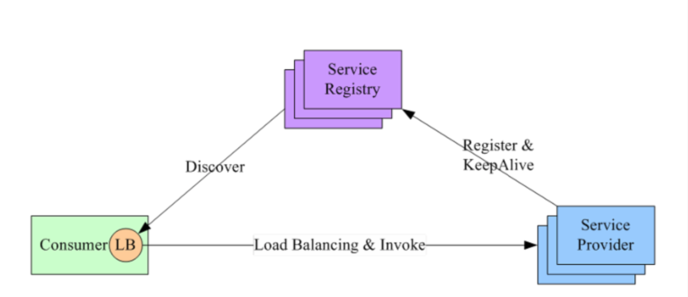
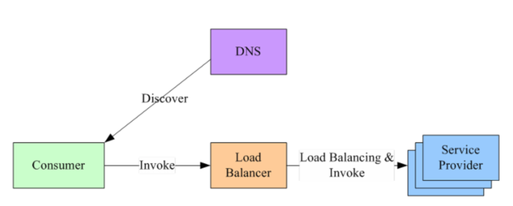
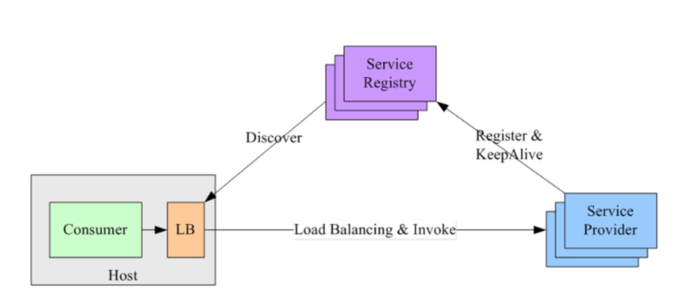

# 服务发现 service discovery

服务发现系统属于 AP 系统，服务状态可以是弱一致。

服务发现的两种模式：微服务的核心是去中心化，通常使用客户端发现模式。

- 客户端发现

服务示例被启动时，会主动将其网络地址写到注册表上，实例终止时再从注册表中删除；服务实例的注册表通过心跳机制动态刷新。

客户端使用一个负载均衡算法从注册表中选择一个可用的服务示例来响应这个请求。

采用直连的方式，比"服务端发现"少一次网络跳转，但是不同编程语言的 Consumer 需要内置特定的服务发现客户端和发现逻辑。

- 服务端发现

客户端通过 LB（Load Balancer） 向一个服务发送请求，而 LB 会去查询服务注册表，并将请求路由到可用的服务实例上去。

如，使用独立的 LB：

> 新服务上线后，会向运维申请一个域名，运维人员会配置该域名，使其指向后台的这个新的服务。Consumer（客户端）会先向 DNS 请求解析域名，得到 LB 的域名地址，然后 LB 再将请求负载均衡到服务的某个副本上。

或在每个主机上都部署一个单独的 LB：

Consumer 无需关注服务发现的具体细节，只需要向 LB 发送请求即可，但是需要部署单独的 LB

## K8s 的服务发现机制

在 K8s 环境下，微服务之间的调用实际上是 Pod 之间的调用。K8s 原生的服务发现机制是 Service。

Pod 之间是可以通过 IP 进行通信的，但是，Pod 的 IP 是不稳定的，假设 Pod 副本数为 2，删除其中一个 Pod 后，ReplicaSet 会重新创建一个 Pod，IP 地址和之间的就不是同一个了。

借鉴 DNS 解析域名得到 IP 地址的思想，K8s 通过 Service 来解决这一问题。

Service 会将一组来自同一个 ReplicaSet 创建的 Pod 组合在一起，并提供 DNS 的访问能力，这样 Pod 直接就可以通过 Service 域名来进行访问了。

> Service IP 是稳定的，在 Service 的配置文件中 metadata.name 就是 Service 的域名
> 
> Service 本身并未直接提供服务发现的能力，需要借助 Endpoints 来实现，Endpoints 记录了一组 Pod 的 IP 地址，Service 只需要查看自身所对应的 Endpoints 就能找到具体的 Pod。
> 
> Service 常用的类型是 ClusterIP。

这种集群内部的 DNS 能力除了提供稳定的访问能力，还能提供负载均衡和会话保持的能力。

# API Gateway

API Gateway 可以屏蔽内部服务间的差异（开发语言、通信协议），

网关在微服务分层中位于负载均衡后面，是为了让网关无状态，这样就可以部署多台，而不会有单点问题。

网关的基本功能：反向路由（会将外部请求转换为内部具体的服务调用）、安全认证、限流熔断、日志监控
