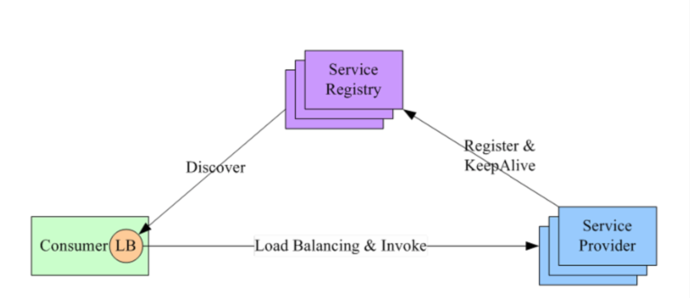
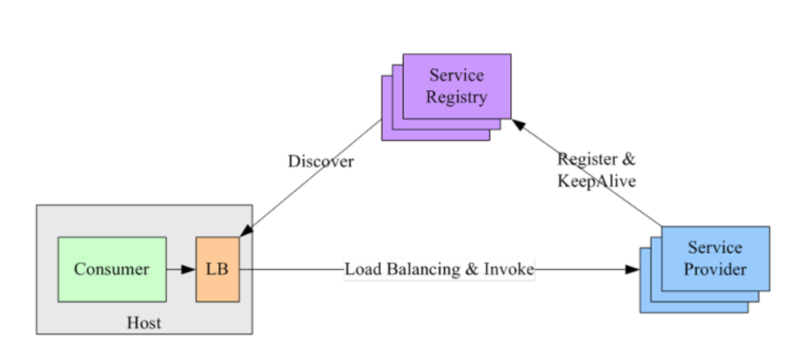

# 分布式系统的 NPC 挑战

分布式系统主要的挑战 NPC：Network Delay、Process Pause、Clock Drift

- Network Delay，网络延迟。虽然网络在多数情况下工作的还可以，虽然TCP保证传输顺序和不会丢失，但它无法消除网络延迟问题。
- Process Pause，进程暂停。有很多种原因可以导致进程暂停：比如编程语言中的 GC 会暂停所有正在运行的线程；再比如，我们有时会暂停云服务器，从而可以在不重启的情况下将云服务器从一台主机迁移到另一台主机。我们无法确定性预测进程暂停的时长，你以为持续几百毫秒已经很长了，但实际上持续数分钟之久进程暂停并不罕见。
- Clock Drift，时钟漂移。现实生活中我们通常认为时间是平稳流逝，单调递增的，但在计算机中不是。计算机使用时钟硬件计时，通常是石英钟，计时精度有限，同时受机器温度影响。为了在一定程度上同步网络上多个机器之间的时间，通常使用NTP协议将本地设备的时间与专门的时间服务器对齐，这样做的一个直接结果是设备的本地时间可能会突然向前或向后跳跃。

# 服务发现 service discovery

服务发现系统属于 AP 系统，服务状态可以是弱一致。

服务发现的两种模式：微服务的核心是去中心化，通常使用客户端发现模式。

- 客户端发现

服务示例被启动时，会主动将其网络地址写到注册表上，实例终止时再从注册表中删除；服务实例的注册表通过心跳机制动态刷新。

客户端使用一个负载均衡算法从注册表中选择一个可用的服务示例来响应这个请求。

采用直连的方式，比"服务端发现"少一次网络跳转，但是不同编程语言的 Consumer 需要内置特定的服务发现客户端和发现逻辑。

- 服务端发现

客户端通过 LB（Load Balancer） 向一个服务发送请求，而 LB 会去查询服务注册表，并将请求路由到可用的服务实例上去。

如，使用独立的 LB：

> 新服务上线后，会向运维申请一个域名，运维人员会配置该域名，使其指向后台的这个新的服务。Consumer（客户端）会先向 DNS 请求解析域名，得到 LB 的域名地址，然后 LB 再将请求负载均衡到服务的某个副本上。

或在每个主机上都部署一个单独的 LB：

Consumer 无需关注服务发现的具体细节，只需要向 LB 发送请求即可，但是需要部署单独的 LB

## K8s 的服务发现机制

在 K8s 环境下，微服务之间的调用实际上是 Pod 之间的调用。K8s 原生的服务发现机制是 Service。

Pod 之间是可以通过 IP 进行通信的，但是，Pod 的 IP 是不稳定的，假设 Pod 副本数为 2，删除其中一个 Pod 后，ReplicaSet 会重新创建一个 Pod，IP 地址和之间的就不是同一个了。

借鉴 DNS 解析域名得到 IP 地址的思想，K8s 通过 Service 对象来解决这一问题。

> K8s 内还有 CoreDNS，CoreDNS 包含了一个内存态的 DNS 以及控制器。控制器监听 Service 和 Endpoint 的变化，并配置 DNS，客户端 Pod 在进行域名解析时，从 CoreDNS 中查询服务对应的地址记录。

当 Service 的 selector 不为空时，Kubernetes Endpoint Controller 会侦听服务创建事件，创建与 Service 同名的 Endpoint 对象。而 Service 的 selector 所选中的所有 PodIP 都会被配置到 Endpoint 对象的 addresses 属性中（尚未 Ready 的 Pod，其 IP 会保存在 notReadyAddresses 属性中，代表不能作为流量转发的目标），所以，Endpoint 对象相当于记录了 Service 和它后面对应的那些 PodIP 的表。

Endpoint 会将这些映射关系推送到每个节点上去，然后通过每个节点上的 kube-proxy 来做负载均衡。

当集群规模很大（一个 Endpoint 对象会记录特别多的 PodIP），且变更会很频繁的时候，Pod 变更会引起 Endpoint 变更，Endpoint 变更会被推送到每个节点，导致持续会占用很多带宽，所以就有了 EndpointSlice 对象，用于对 Pod 较多的 Endpoint 进行切片，这样，每次只需推送变更了的 Endpoint 对象。

> Service 的 selector 为空时，不会自动创建 Endpoint 对象，可以自己创建 Endpoint 对象，且 IP 可以任意配置。
> 
> kube-proxy 相当于在每个节点上都部署了一个 LB（负载均衡器）

这种集群内部的 DNS 能力除了提供稳定的访问能力，还能提供负载均衡和会话保持的能力。

# API Gateway

API Gateway 可以屏蔽内部服务间的差异（开发语言、通信协议），

网关在微服务分层中位于负载均衡后面，是为了让网关无状态，这样就可以部署多台，而不会有单点问题。

网关的基本功能：反向路由（会将外部请求转换为内部具体的服务调用）、安全认证、限流熔断、日志监控
