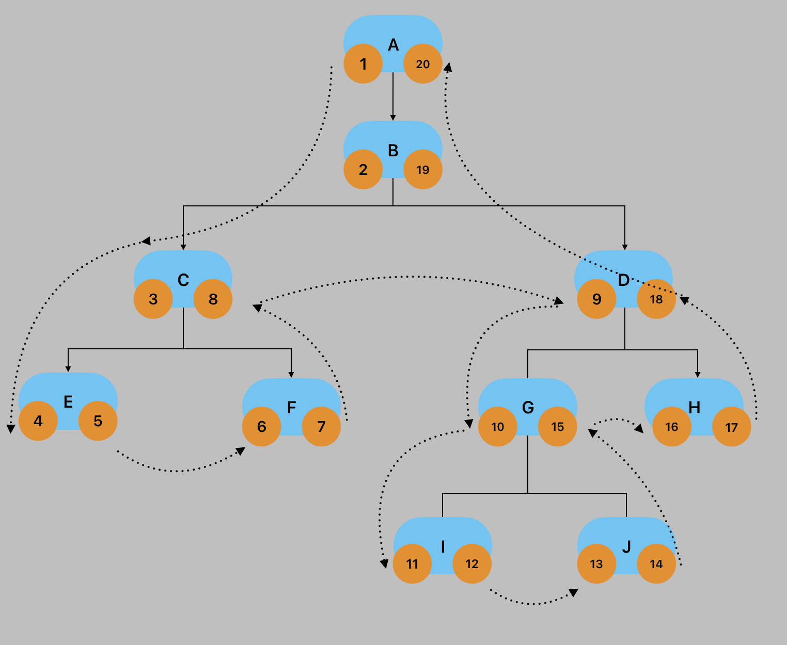

在一些需求中会需要在数据库中存储一棵树，如可以无限层级的邀请关系记录、组织架构图等，这种**一父多子**的继承关系正好对应了数据结构中的树，所以就需要在数据库中存储一棵树，并且支持相关的操作。

常见的操作有：增加邀请关系、查询某个用户的邀请路径、查询某个用户直接/间接邀请的所有用户、查询某个用户的直接邀请用户。

> 修改邀请关系即对树结构修改的需求不合理，且数据库操作很复杂，故这里忽不讨论相关操作。
> 
> 通常数据库的删除操作不建议使用硬删除，而是使用软删除，使用状态字段来标记该记录是否有效，所以这里也不讨论删除操作。

# 直接记录父级的引用

在数据库中直接记录父级的引用：

```sql
CREATE TABLE `invitation`
(
    `id`    bigint unsigned NOT NULL AUTO_INCREMENT COMMENT '数据库自增物理主键',
    `wid`   varchar(10)     NOT NULL DEFAULT '' COMMENT '钱包ID',
    `pid`   varchar(10)     NOT NULL DEFAULT '' COMMENT '父级 ID',
    `level` int             NOT NULL DEFAULT '1' COMMENT '层级',
    PRIMARY KEY (`id`)
) ENGINE = InnoDB
  DEFAULT CHARSET = utf8mb4
  COLLATE = utf8mb4_unicode_ci COMMENT ='邀请关系表';
```

这种方式简单易懂，存储空间占用很小。

对相关操作的支持：

- 增加邀请关系在知道父级 id 的情况下，仅需插入一条记录即可
- 查询直接邀请用户也仅需一句 sql 即可
- 查询某个用户直/间接邀请的所有用户都比较麻烦，需要递归完成，且后者的递归更是灾难，需要先找出所有的直接邀请下级用户，在对每个直接邀请的下级用户递归... 该功能几乎废了
- 查询某个用户的邀请路径，需要递归完成

## MySQL 的 CTE

MySQL 8.0 开始支持了 CTE 功能，也叫公共表表达式，可以更好的进行数据库的递归！这里仅简单说明如何利用 CTE 进行递归操作。

CTE 的基本语法：

```sql
WITH cte_name1 (column_list) AS ( # column_list 必须和下面 query 的列数相同！可以省略 column_list 
    query
),     # 逗号分隔
WITH cte_name2 (column_list) AS ( # column_list 必须和下面 query 的列数相同！可以省略 column_list 
    query # 这里可以和 cte_name1 进行关联的查询
)
SELECT * FROM cte_name2;
```

递归查询某个用户的邀请路径：

```sql
with recursive inv(wid, pid) as (
    select `wid`, `pid` from `invitation` where `invitation`.`wid` = 'abcdefg' # 锚成员 anchor member
    union all
    select `i`.`wid`, `i`.`pid` from `inv` join `invitation` i on `inv`.`pid` = `i`.`wid` # 递归查询
)
select * from inv;
```

递归 CTE 由三个主要部分组成：

- 形成 CTE 结构的基本结果集的初始查询，初始查询部分被称为铆成员；
- 递归查询部分是引用CTE名称的查询，因此称为递归成员。递归成员由一个 `UNION ALL` 或 `UNION DISTINCT` 运算符与锚成员相连；
- 终止条件是当递归成员没有返回任何行时，确保递归终止

递归 CTE 的执行顺序：

1. 将成员分为锚点、递归成员
2. 执行铆成员形成基本结果集 R0，并使用该基本结果集进行下一次迭代
3. 将 Ri 结果集作为输入，然后执行递归成员，并将 Ri+1 作为输出
4. 重复上一步，知道递归成员返回一个空结果集，即满足终止条件
5. 使用 `UNION ALL` 运算符将结果集从 R0 到 Rn 组合

# 记录路径列表

在表中不仅记录父节点 id，而是将它到顶级用户之间所有用户的 id 都保存下来，即 path。每个用户之间用逗号分开，从左往右依次是顶级用户到父级的 id。

查询下级时使用 `like` 运算符：`select * from table where path like '1,%'`；

查询直属下级时使用 `like` 运算符：`select * from table where path like '%,2'`；

查询邀请路径可以直接对该用户的 path 字段进行分割。

这种设计不遵守数据库范式，将列表数据直接作为字符串来存储，导致一些操作需要解析 path 字段的值；且字段长度是有限的，无法实现真正的无限层级，且大字段对索引不利。

# 前序遍历树

这种方案的思想不是直接存储父节点 id，而是用前序遍历的顺序来判断用户间的关系。

[你在用递归查询 MySQL 的树形结构吗？](https://juejin.cn/post/7076079848824766494)

```sql
CREATE TABLE(
    `id`    bigint unsigned NOT NULL AUTO_INCREMENT COMMENT '数据库自增物理主键',
    `name`  varchar(10)     NOT NULL DEFAULT '' COMMENT '名称',
    `lft`   int unsigned    NOT NULL DEFAULT '0' COMMENT '左值',
    `rgt`   int unsigned    NOT NULL DEFAULT '0' COMMENT '右值',
    `level` int             NOT NULL DEFAULT '1' COMMENT '层级',
    PRIMARY KEY (`id`)
) ENGINE = InnoDB
  DEFAULT CHARSET = utf8mb4
  COLLATE = utf8mb4_unicode_ci COMMENT ='邀请关系表';
```



左值更大右值更小的节点是下级节点，左值更小右值更大的是上级节点。改方案在移动树结构时不友好，数据量大时，改动一下会很要命！

相关操作：

- 新增初始用户（lft = 1, rgt = 2）

```sql
insert into `invitation`(`name`, `lft`, `rgt`, `level`) values('A', 1, 2, 1);
```

- 新增邀请用户

```sql
set @lft = 2; # 等于 p_rgt
set @rgt = 3; # 等于 p_rgt+1
set @level = 2; # 等于 p_level+1
begin; # 开启事务！！！
# 更新原有相关节点的左右值，符合条件的自增 2
update `invitation` set `lft`=`lft`+2 where `lft` > @lft;
update `invitation` set `rgt`=`rgt`+2 where `rgt` >= @lft;
# 插入数据
insert into `invitation`(`name`, `lft`, `rgt`, `level`) values('B', @lft, @rgt, @level);
commit;
```

- 删除用户和新增用户操作相反，需要对符合条件记录的左右值自减 2
  - 不建议硬删除，而是用状态字段进行软删除，所以不列出
- 查询某个 leader 下成员总数(不含 leader)：`(rgt - lft)/2`，如果是软删除，可以对所有成员 count
- 判断是否为叶子节点：`rgt - 1 == lft`

- 查询某个 leader 下的所有成员(含 leader)

```sql
set @leader_lft = 9;
set @leader_rgt = 18;
select * from `invitation` where `lft` between @leader_lft and @leader_rgt order by `lft` asc;
```

- 查询某个用户的直推用户，可以增加一个 pid 字段，记录其直属上层用户，查询更方便

```sql
set @p_lft = 9;
set @p_rgt = 18;
set @p_level = 3;
select * from `invitation` where `lft` > @p_lft and `rgt` < @p_rgt and `level` = @p_level+1;
```

- 查询指定用户的邀请路径(不含当前用户)

```sql
set @lft = 13; # 当前用户
set @rgt = 14; # 当前用户
# 从初始用户该到指定用户的父级
select * from `invitation` where `lft` < @lft and `rgt` > @rgt order by `lft` asc;
```

# ClosureTable 闭包表

[MySQL 数据库闭包表](https://www.jb51.net/article/272596.htm)

以上三种方案最接近理想的就是第二种，而第二种方案[记录路径列表](#记录路径列表)如果可以解决字段长度问题和不符合范式，以及需要上层参与处理的问题就好了。

第二种方案为了确保效率，才需要记录所有的上级信息，而不能仅有直属上级，所以增加了 ppath 字段，但是，数据库的表本身就是用于保存这种结构化数据的，所以是否可以做一张关联表来代替 path 字段呢？

path 的本质记录了两种信息：所有上级的 id、从顶级到每个父级的距离，所以新增的表实现这两种信息的记录即可。

```sql
# 个人信息表
CREATE TABLE `node`
(
    `id`   int(11) unsigned NOT NULL AUTO_INCREMENT,
    `name` varchar(100)     NOT NULL DEFAULT '' COMMENT '名称',
    PRIMARY KEY (`id`)
) ENGINE = InnoDB
  DEFAULT CHARSET = utf8mb4 COMMENT ='节点表';

# 关系表，记录了任意两个有关系节点的关联信息！
CREATE TABLE `invitation_tree`
(
    `ancestor`   int(11) unsigned NOT NULL DEFAULT 0 COMMENT '祖先节点',
    `descendant` int(11) unsigned NOT NULL DEFAULT 0 COMMENT '后代节点',
    `distance`   int(11) unsigned NOT NULL DEFAULT 0 COMMENT '祖先距离后代的距离',
    PRIMARY KEY (`ancestor`, `descendant`),
    KEY `descendant` (`descendant`)
) ENGINE = InnoDB
  DEFAULT CHARSET = utf8mb4 COMMENT ='邀请关系表';
```

以下数据库写操作都必须在事务中操作！！！！！！

- 初始化顶级用户

```sql
# 插入用户信息
insert into `node`(`name`) values ('A');
# 记录自己到自己的关系（这里的值是上一步生成的自增 id）
insert into `invitation_tree`(`ancestor`, `descendant`, `distance`) values (1, 1, 0);
```

- 新增邀请关系

```sql
-- 新增邀请关系：A->B
# 插入用户信息
insert into `node`(`name`) values ('B');
SET @descendant = (select @@IDENTITY); # 获取上一步插入后的自增ID
SET @parent = 6; # 直属上级的 ID
# 记录自己到自己的路径（这里的值是上一步生成的自增 id）
insert into `invitation_tree`(`ancestor`, `descendant`, `distance`) values (@descendant, @descendant, 0);
# 记录顶级用户和自己的路径
insert into `invitation_tree`(`ancestor`, `descendant`, `distance`) SELECT ancestor, @descendant, distance + 1 from invitation_tree where descendant = @parent;
```

- 查询某个 leader 下所有的节点

```sql
select n2.name
from node n1
join invitation_tree t on n1.id = t.ancestor
join node n2 on t.descendant = n2.id
where n1.name = 'B' and t.distance != 0
```

- 查询某个用户的直推用户

```sql
select n2.name
from node n1
join invitation_tree t on n1.id = t.ancestor
join node n2 on t.descendant = n2.id
where n1.name = 'B' and t.distance = 1
```

- 查询某个用户的邀请路径

```sql
select t.*, n2.name
from node n1
join invitation_tree t on n1.id = t.descendant
join node n2 on t.ancestor = n2.id
where n1.name = 'B'
order by t.distance desc
```

优点：在查询树形结构的任意关系时都很方便；

缺点：需要存储的数据量比较多，索引表需要的空间比较大，增加和删除节点相对麻烦。